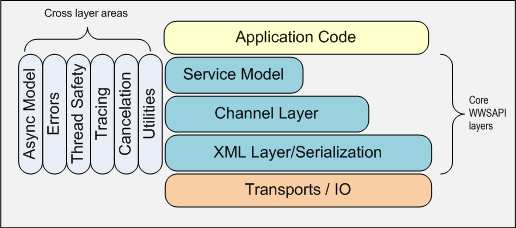

# About Windows Web Services

The Windows Web Services API is a layered API and it may be pictured as follows

The WWSAPI is a layered API. We expect most developers to target the Service Model, which is a method-based programming model. In the Service Model, the Service Host provides the server side programming model, while Service Proxy provides the client side programming model.

Every layer exposes a set of APIs and types that can be used with APIs of that layer.

## Service Model

The top level layer called the [Service Model](service-model-layer-overview.md) provides a method-based programming model and it is the easiest model to use. In the Service Model, the [Service Host](service-host.md) provides the server side programming model, while the [Service Proxy](service-proxy.md) provides the client side programming model. [Context](context.md) is used within the Service Model to pass in a relevant state available to the service operation and/or the callback when it is invoked. And [Service Contract](contract.md) is used to specify a service contract on an endpoint exposed on the service. The following components and operations are part of the Service Layer:

-   [Service Host](service-host.md)
-   [Service Proxy](service-proxy.md)
-   [Context](context.md)
-   [Contract](contract.md)
-   [Service Metadata](service-metadata.md)

## Channel Layer

The Service Model is built upon a Channel Layer, which provides full flexibility but is more difficult to use. The following components and operations are part of the Channel Layer:

-   [Message](message.md)
-   [Channel](channel.md)
-   [Listener](listener.md)
-   [Faults](faults.md)
-   [Url](url.md)
-   [Security](security-overview.md)
-   [Metadata Import](metadata-import.md)

## XML Layer

The Channel Layer is in turn built upon a lightweight XML framework, which includes deserialization of C data types. The following components and operations are part of the XML Layer:

-   [XML Writer](xml-writer.md)
-   [XML Reader](xml-reader.md)
-   [XML Buffer](xml-buffer.md)
-   [Serialization](serialization.md)
-   [XML Language Support](xml-language-support.md)

## Common to all layers

The following are topics that apply to any of the three layers:

-   [Errors](errors.md)
-   [Asynchronous Model](asynchronous-model.md)
-   [Thread Safety](thread-safety.md)
-   [Tracing](tracing.md)
-   [Cancellation](cancellation.md)
-   [Utilities](utilities.md)
-   [Debugging](debugging.md)
-   [Wsutil Compiler tool](wsutil-compiler-tool.md)
-   [Heap](heap.md)

## Examples

For more information about API elements, see [Windows Web Services Reference](windows-web-services-reference.md). For examples of using the API, see [Using Windows Web Services](using-windows-web-services.md).

 

 

