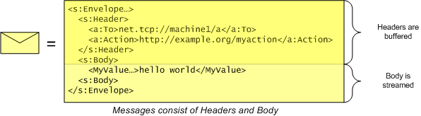
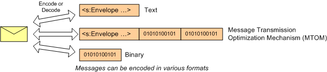
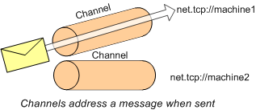
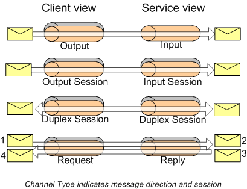
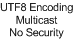
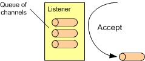

# Channel Layer Overview

The Channel Layer provides an abstraction of the transport channel as well as messages sent out on the channel. It also includes functions for the serialization of C data types to and from SOAP structures. The Channel Layer enables full control of communications by means of [messages](message.md) consisting of data sent or received and containing bodies and headers, and [channels](channel.md) that abstract message exchange protocols and provide properties for customizing settings.

## Message

A [message](message.md) is an object that encapsulates network data — specifically, data that is transmitted or received over a network. The message structure is defined by SOAP, with a discrete set of headers and a message body. The headers are placed in a memory buffer, and the message body is read or written using a stream API.



Although the data model of a message is always the XML data model, the actual wire format is flexible. Before a message is transmitted, it is encoded using a particular encoding (such as Text, Binary, or MTOM). See [**WS\_ENCODING**](/windows/desktop/api/WebServices/ne-webservices-ws_encoding) for more information on encodings.



## Channel

A [channel](channel.md) is an object used to send and receive messages on a network between two or more endpoints.

Channels have associated data that describes how to [address](endpoint-address.md) the message when it is sent. Sending a message on a channel is like placing it in a chute — the channel includes the information where the message should go and how to get it there.



Channels are categorized into [**channel types**](/windows/desktop/api/WebServices/ne-webservices-ws_channel_type). A channel type specifies which direction messages can flow. The channel type also identifies whether the channel is sessionful, or sessionless. A session is defined as an abstract way of correlating messages between two or more parties. An example of a sessionful channel is a TCP channel, which uses the TCP connection as the concrete session implementation. An example of a sessionless channel is UDP, which does not have an underlying session mechanism. Although HTTP does have underlying TCP connections, this fact is not directly exposed through this API and therefore HTTP is also considered a sessionless channel.



Although channel types describe the direction and session information for a channel, they do not specify how the channel is implemented. What protocol should the channel use? How hard should the channel try to deliver the message? What kind of security is used? Is it singlecast or multicast? These settings are referred to as the "binding" of the channel. The binding consists of the following:

-   A [**WS\_CHANNEL\_BINDING**](/windows/desktop/api/WebServices/ne-webservices-ws_channel_binding), which identifies the transfer protocol to use (TCP, UDP, HTTP, NAMEDPIPE).
-   A [**WS\_SECURITY\_DESCRIPTION**](/windows/desktop/api/WebServices/ns-webservices-ws_security_description), which specifies how to secure the channel.
-   A set [**WS\_CHANNEL\_PROPERTY**](/windows/desktop/api/WebServices/ns-webservices-ws_channel_property)s, which specify additional optional settings. See [**WS\_CHANNEL\_PROPERTY\_ID**](/windows/desktop/api/WebServices/ne-webservices-ws_channel_property_id) for the list of properties.



## Listener

To start communicating, the client creates a Channel object. But how does the service get its Channel object? It does so by creating a [Listener](listener.md). Creating a listener requires the same binding information that is necessary to create a channel. Once a Listener has been created, the application can Accept Channels from the Listener. Since the application may fall behind in accepting channels, listeners typically keep a queue of channels that are ready to accept (up to some quota).



## Initiating Communication (client)

To initiate communication on the client, use the following sequence.

``` syntax
WsCreateChannel
for each address being sent to
{
    WsOpenChannel           // open channel to address
    // send and/or receive messages
    WsCloseChannel          // close channel
    WsResetChannel?         // reset if opening again
}
WsFreeChannel
```

## Accepting Communication (server)

To accept incoming communications on the server, use the following sequence.

``` syntax
WsCreateListener
WsOpenListener
for each channel being accepted (can be done in parallel)
{
    WsCreateChannelForListener
    for each accept
    {
        WsAcceptChannel     // accept the channel
        // send and/or receive messages
        WsCloseChannel      // close the channel
        WsResetChannel?     // reset if accepting again
    }
    WsFreeChannel
}
WsCloseListener
WsFreeListener
```

## Sending Messages (client or server)

To send messages, use the following sequence.

``` syntax
WsCreateMessageForChannel
for each message being sent
{
    WsSendMessage       // send message
    WsResetMessage?     // reset if sending another message
}
WsFreeMessage
```

The [**WsSendMessage**](/windows/desktop/api/WebServices/nf-webservices-wssendmessage) function does not allow for streaming, and assumes that the body contains only one element. To avoid these constraints, use the following sequence instead of **WsSendMessage**.

``` syntax
WsInitializeMessage     // initialize message to WS_BLANK_MESSAGE
WsSetHeader             // serialize action header into header buffer
WsAddressMessage?       // optionally address message
for each application defined header
{
    WsAddCustomHeader   // serialize application-defined headers into header buffer
}
WsWriteMessageStart     // write out the headers of the message
for each element of the body
{
    WsWriteBody         // serialize the element of the body
    WsFlushBody?        // optionally flush the body
}
WsWriteMessageEnd       // write the end of the message
```

The [**WsWriteBody**](/windows/desktop/api/WebServices/nf-webservices-wswritebody) function uses serialization to write the body elements. To write the data directly to the XML Writer, use the following sequence instead of **WsWriteBody**.

``` syntax
WS_MESSAGE_PROPERTY_BODY_WRITER     // get the writer used to write the body
WsWriteStartElement
// use the writer functions to write the body
WsWriteEndElement
// optionally flush the body
WsFlushBody?        
```

The [**WsAddCustomHeader**](/windows/desktop/api/WebServices/nf-webservices-wsaddcustomheader) function uses serialization to set the headers to the header buffer of the message. To use the XML Writer to write a header, use the following sequence instead of **WsAddCustomHeader**.

``` syntax
WS_MESSAGE_PROPERTY_HEADER_BUFFER   // get the header buffer 
WsCreateWriter                      // create an xml writer
WsSetOutputToBuffer                 // specify output of writer should go to buffer
WsMoveWriter*                       // move to inside envelope header element
WsWriteStartElement                 // write application header start element
// use the writer functions to write the header 
WsWriteEndElement                   // write appilcation header end element
```

## Receiving Messages (client or server)

To receive messages, use the following sequence.

``` syntax
WsCreateMessageForChannel
for each message being received
{
    WsReceiveMessage            // receive a message
    WsGetHeader*                // optionally access standard headers such as To or Action
    WsResetMessage              // reset if reading another message
}
WsFreeMessage
```

The [**WsReceiveMessage**](/windows/desktop/api/WebServices/nf-webservices-wsreceivemessage) function does not allow for streaming, and assumes that the body contains only one element, and that the type of the message (action and schema of the body) is known up front. To avoid these constraints, use the following sequence instead of **WsReceiveMessage**.

``` syntax
WsReadMessageStart              // read all headers into header buffer
for each standard header
{
    WsGetHeader                 // deserialize standard header such as To or Action
}
for each application defined header
{
    WsGetCustomHeader           // deserialize application defined header
}
for each element of the body
{
    WsFillBody?                 // optionally fill the body
    WsReadBody                  // deserialize element of body
}
WsReadMessageEnd                // read end of message
```

The [**WsReadBody**](/windows/desktop/api/WebServices/nf-webservices-wsreadbody) function uses serialization to read the body elements. To read the data directly from the [XML Reader](xml-reader.md), use the following sequence instead of **WsReadBody**.

``` syntax
WS_MESSAGE_PROPERTY_BODY_READER     // get the reader used to read the body
WsFillBody?                         // optionally fill the body
WsReadToStartElement                // read up to the body element
WsReadStartElement                  // consume the start of the body element
// use the read functions to read the contents of the body element
WsReadEndElement                    // consume the end of the body element
```

The [**WsGetCustomHeader**](/windows/desktop/api/WebServices/nf-webservices-wsgetcustomheader) functions use serialization to get the headers from the header buffer of the message. To use the [XML Reader](xml-reader.md) to read a header, use the following sequence instead of **WsGetCustomHeader**.

``` syntax
WS_MESSAGE_PROPERTY_HEADER_BUFFER   // get the header buffer 
WsCreateReader                      // create an xml reader
WsSetInputToBuffer                  // specify input of reader should be buffer
WsMoveReader*                       // move to inside header element
while looking for header to read
{
    WsReadToStartElement            // see if the header matches the application header
    if header matched
    {
        WsGetHeaderAttributes?      // get the standard header attributes
        WsReadStartElement          // consume the start of the header element
        // use the read functions to read the contents of the header element
        WsReadEndElement            // consume the end of the header element
    }
    else
    {
        WsSkipNode                  // skip the header element
    }
}                
```

## Request Reply (client)

Performing a request-reply on the client can be done with the following sequence.

``` syntax
WsCreateMessageForChannel               // create request message 
WsCreateMessageForChannel               // create reply message 
for each request reply
{
    WsRequestReply                      // send request, receive reply
    WsResetMessage?                     // reset request message (if repeating)
    WsResetMessage?                     // reset reply message (if repeating)
}
WsFreeMessage                           // free request message
WsFreeMessage                           // free reply message
```

The [**WsRequestReply**](/windows/desktop/api/WebServices/nf-webservices-wsrequestreply) function assumes a single element for the body of the request and reply messages, and that the type of the message (action and schema of the body) are known up front. To avoid these limitations, the request and reply message can be sent manually, as shown in the following sequence. This sequence matches the earlier sequence for sending and receiving a message, except where noted.

``` syntax
WsInitializeMessage     // initialize message to WS_BLANK_MESSAGE
WsSetHeader             // serialize action header into header buffer
WsAddressMessage?       // optionally address message

// the following block is specific to sending a request
{
    generate a unique MessageID for request
    WsSetHeader         // set the message ID            
}

for each application defined header
{
    WsAddCustomHeader   // serialize application-defined headers into header buffer
}
WsWriteMessageStart     // write out the headers of the message
for each element of the body
{
    WsWriteBody         // serialize the element of the body
    WsFlushBody?        // optionally flush the body
}
WsWriteMessageEnd       // write the end of the message

WsReadMessageStart      // read all headers into header buffer

// the following is specific to receiving a reply
{
    WsGetHeader         // deserialize RelatesTo ID of reply
    verify request MessageID is equal to RelatesTo ID
}

for each standard header
{
    WsGetHeader         // deserialize standard header such as To or Action
}
for each application defined header
{
    WsGetCustomHeader   // deserialize application defined header
}
for each element of the body
{
    WsFillBody?         // optionally fill the body
    WsReadBody          // deserialize element of body
}
WsReadMessageEnd        // read end of message                
```

## Request Reply (server)

To receive a request message on the server, use the same sequence as outlined in the previous section on receiving messages.

To send a reply or fault message, use the following sequence.

``` syntax
WsCreateMessageForChannel
for each reply being sent
{
    WsSendReplyMessage | WsSendFaultMessageForError  // send reply or fault message
    WsResetMessage?     // reset if sending another message
}
WsFreeMessage
```

The [**WsSendReplyMessage**](/windows/desktop/api/WebServices/nf-webservices-wssendreplymessage) function assumes a single element in the body and does not allow for streaming. To avoid these limitations, use the following sequence. This is the same as the earlier sequence for sending a message, but uses [**WS\_REPLY\_MESSAGE**](/windows/desktop/api/WebServices/ne-webservices-ws_message_initialization) instead of **WS\_BLANK\_MESSAGE** when initializing.

``` syntax
// the following block is specific to sending a reply
{
    WsInitializeMessage // initialize message to WS_REPLY_MESSAGE
}
WsSetHeader             // serialize action header into header buffer                                
WsAddressMessage?       // optionally address message
for each application defined header
{
    WsAddCustomHeader   // serialize application-defined headers into header buffer
}
WsWriteMessageStart     // write out the headers of the message
for each element of the body
{
    WsWriteBody         // serialize the element of the body
    WsFlushBody?        // optionally flush the body
}
WsWriteMessageEnd       // write the end of the message
```

## Message Exchange Patterns

The [**WS\_CHANNEL\_TYPE**](/windows/desktop/api/WebServices/ne-webservices-ws_channel_type) dictates the message exchange pattern possible for a given channel. The type supported, varies according to the binding, as follows:

-   [**WS\_HTTP\_CHANNEL\_BINDING**](/windows/desktop/api/WebServices/ne-webservices-ws_channel_binding) supports [**WS\_CHANNEL\_TYPE\_REQUEST**](/windows/desktop/api/WebServices/ne-webservices-ws_channel_type) on the client and **WS\_CHANNEL\_TYPE\_REPLY** on the server.
-   [**WS\_TCP\_CHANNEL\_BINDING**](/windows/desktop/api/WebServices/ne-webservices-ws_channel_binding) supports [**WS\_CHANNEL\_TYPE\_DUPLEX\_SESSION**](/windows/desktop/api/WebServices/ne-webservices-ws_channel_type) on the client and **WS\_CHANNEL\_TYPE\_DUPLEX\_SESSION** on the server.
-   [**WS\_UDP\_CHANNEL\_BINDING**](/windows/desktop/api/WebServices/ne-webservices-ws_channel_binding) supports [**WS\_CHANNEL\_TYPE\_DUPLEX**](/windows/desktop/api/WebServices/ne-webservices-ws_channel_type) on the client and **WS\_CHANNEL\_TYPE\_INPUT** on the server.
-   [**WS\_NAMEDPIPE\_CHANNEL\_BINDING**](/windows/desktop/api/WebServices/ne-webservices-ws_channel_binding) supports [**WS\_CHANNEL\_TYPE\_DUPLEX**](/windows/desktop/api/WebServices/ne-webservices-ws_channel_type) on the client and **WS\_CHANNEL\_TYPE\_INPUT** on the server.

## Message Loops

For each message exchange pattern, there is a specific "loop" that can be used to send or receive messages. The loop describes the legal order of operations necessary to send/receive multiple messages. The loops are describes below as grammar productions. The 'end' term is a receive where **WS\_S\_END** is returned (See [Windows Web Services Return Values](windows-web-services-return-values.md)), indicating no more messages are available on the channel. The parallel production specifies that for parallel(x & y) that operation x may be done concurrently with y.

The following loops are used on the client:

``` syntax
client-loop := client-request-loop | client-duplex-session-loop | client-duplex-loop
client-request-loop := open (send (receive | end))* close // WS_CHANNEL_TYPE_REQUEST
client-duplex-session-loop := open parallel(send* & receive*) parallel(send? & end*) close // WS_CHANNEL_TYPE_DUPLEX_SESSION
client-duplex-loop := open parallel(send & receive)* close // WS_CHANNEL_TYPE_DUPLEX
```

The following loops are used on the server:

``` syntax
server-loop: server-reply-loop | server-duplex-session-loop | server-duplex-loop
server-reply-loop := accept receive end* send? end* close // WS_CHANNEL_TYPE_REPLY
server-duplex-session-loop := accept parallel(send* & receive*) parallel(send* & end*) close // WS_CHANNEL_TYPE_DUPLEX_SESSION
server-input-loop := accept receive end* close // WS_CHANNEL_TYPE_INPUT
```

Using the [**WS\_SECURITY\_CONTEXT\_MESSAGE\_SECURITY\_BINDING**](/windows/desktop/api/WebServices/ns-webservices-ws_security_context_message_security_binding) on the server requires a successful receive before sending is allowed even with a channel of type [**WS\_CHANNEL\_TYPE\_DUPLEX\_SESSION**](/windows/desktop/api/WebServices/ne-webservices-ws_channel_type). After the first receive. the regular loop applies.

Note that channels of type [**WS\_CHANNEL\_TYPE\_REQUEST**](/windows/desktop/api/WebServices/ne-webservices-ws_channel_type) and **WS\_CHANNEL\_TYPE\_REPLY** can be used to send and receive one-way messages (as well as the standard request-reply pattern). This is accomplished by closing the reply channel without sending a reply. In this case, there will be no reply received on the request channel. The return value **WS\_S\_END** Using the [**WS\_SECURITY\_CONTEXT\_MESSAGE\_SECURITY\_BINDING**](/windows/desktop/api/WebServices/ns-webservices-ws_security_context_message_security_binding) on the server requires a successful receive before sending is allowed even with a channel of type **WS\_CHANNEL\_TYPE\_DUPLEX\_SESSION**. After the first receive the regular loop applies.

will be returned, indicating no message available.

Client or server loops may be done in parallel with each other by using multiple channel instances.

``` syntax
parallel-client: parallel(client-loop(channel1) & client-loop(channel2) & ...)
parallel-server: parallel(server-loop(channel1) & server-loop(channel2) & ...)
```

## Message Filtering

A server channel may filter received messages that are not intended for the application, such as messages that establish a [security context](security-context.md). In that case **WS\_S\_END** will be returned from [**WsReadMessageStart**](/windows/desktop/api/WebServices/nf-webservices-wsreadmessagestart) and no application messages will be available on that channel. However, this does not signal that the client intended to end communication with the server. More messages may be available on another channel. See [**WsShutdownSessionChannel**](/windows/desktop/api/WebServices/nf-webservices-wsshutdownsessionchannel).

## Cancellation

The [**WsAbortChannel**](/windows/desktop/api/WebServices/nf-webservices-wsabortchannel) function is used to cancel pending IO for a channel. This API will not wait for the IO operation(s) to complete. See the [**WS\_CHANNEL\_STATE**](/windows/desktop/api/WebServices/ne-webservices-ws_channel_state) state diagram and documentation for **WsAbortChannel** for more information.

The [**WsAbortListener**](/windows/desktop/api/WebServices/nf-webservices-wsabortlistener) API is used to cancel pending IO for a listener. This API will not wait for the IO operation(s) to complete. Aborting a listener will cause any pending accepts to be aborted as well. See the [**WS\_LISTENER\_STATE**](/windows/desktop/api/WebServices/ne-webservices-ws_listener_state) state diagram and **WsAbortListener** for more information.

## TCP

The [**WS\_TCP\_CHANNEL\_BINDING**](/windows/desktop/api/WebServices/ne-webservices-ws_channel_binding) supports SOAP over TCP. The SOAP over TCP specification builds upon the .NET Framing mechanism.

Port sharing is not supported in this version. Each listener that is opened must use a different port number.

## UDP

The [**WS\_UDP\_CHANNEL\_BINDING**](/windows/desktop/api/WebServices/ne-webservices-ws_channel_binding) supports SOAP over UDP.

There are a number of limitations with the UDP binding:

-   There is no support for security.
-   Messages may be lost or duplicated.
-   Only one encoding is supported: [**WS\_ENCODING\_XML\_UTF8**](/windows/desktop/api/WebServices/ne-webservices-ws_encoding).
-   Messages are fundamentally limited to 64k, and frequently have a greater chance being lost if the size exceeds the MTU of the network.

## HTTP

The [**WS\_HTTP\_CHANNEL\_BINDING**](/windows/desktop/api/WebServices/ne-webservices-ws_channel_binding) supports SOAP over HTTP.

To control HTTP specific headers on the client and server, see [**WS\_HTTP\_MESSAGE\_MAPPING**](/windows/desktop/api/WebServices/ns-webservices-ws_http_message_mapping).

To send and receive non-SOAP messages on the server, use [**WS\_ENCODING\_RAW**](/windows/desktop/api/WebServices/ne-webservices-ws_encoding) for [**WS\_CHANNEL\_PROPERTY\_ENCODING**](/windows/desktop/api/WebServices/ne-webservices-ws_channel_property_id).

## NAMEDPIPES

The [**WS\_NAMEDPIPE\_CHANNEL\_BINDING**](/windows/desktop/api/WebServices/ne-webservices-ws_channel_binding) supports SOAP over named pipes, allowing communication with the Windows Communication Foundation (WCF) service using NetNamedPipeBinding.

## Correlating Request/Reply Messages

Request/Reply messages are correlated in one of two ways:

-   Correlation is done using the channel as the correlation mechanism. For example, when using [**WS\_ADDRESSING\_VERSION\_TRANSPORT**](/windows/desktop/api/WebServices/ne-webservices-ws_addressing_version) and [**WS\_HTTP\_CHANNEL\_BINDING**](/windows/desktop/api/WebServices/ne-webservices-ws_channel_binding) the reply for the request message is correlated to the request by the fact that is it is the entity body of the HTTP response.
-   Correlation is done using the MessageID and RelatesTo headers. This mechanism is used with [**WS\_ADDRESSING\_VERSION\_1\_0**](/windows/desktop/api/WebServices/ne-webservices-ws_addressing_version) and **WS\_ADDRESSING\_VERSION\_0\_9** (even when using [**WS\_HTTP\_CHANNEL\_BINDING**](/windows/desktop/api/WebServices/ne-webservices-ws_channel_binding)). In this case, the request message includes the MessageID header. The response message includes a RelatesTo header that has the value of the request's MessageID header. The RelatesTo header allows the client to correlate a response with a request it sent.

The following channel layer APIs automatically use the appropriate correlation mechanisms based on the [**WS\_ADDRESSING\_VERSION**](/windows/desktop/api/WebServices/ne-webservices-ws_addressing_version) of the channel.

-   [**WsRequestReply**](/windows/desktop/api/WebServices/nf-webservices-wsrequestreply)
-   [**WsSendReplyMessage**](/windows/desktop/api/WebServices/nf-webservices-wssendreplymessage)
-   [**WsSendFaultMessageForError**](/windows/desktop/api/WebServices/nf-webservices-wssendfaultmessageforerror)

If these APIs are not used, the headers can be manually added and accessed using [**WsSetHeader**](/windows/desktop/api/WebServices/nf-webservices-wssetheader) or [**WsGetHeader**](/windows/desktop/api/WebServices/nf-webservices-wsgetheader).

## Custom Channels and Listeners

If the predefined set of channel bindings do not meet the needs of the application, then a custom channel and listener implementation can be defined by specifying [**WS\_CUSTOM\_CHANNEL\_BINDING**](/windows/desktop/api/WebServices/ne-webservices-ws_channel_binding) when creating the channel or listener. The actual implementation of the channel/listener is specified as a set of callbacks via [**WS\_CHANNEL\_PROPERTY\_CUSTOM\_CHANNEL\_CALLBACKS**](/windows/desktop/api/WebServices/ne-webservices-ws_channel_property_id) or [**WS\_LISTENER\_PROPERTY\_CUSTOM\_LISTENER\_CALLBACKS**](/windows/desktop/api/WebServices/ne-webservices-ws_listener_property_id) properties. Once a custom channel or listener are created, the result is a [WS\_CHANNEL](ws-channel.md) or [WS\_LISTENER](ws-listener.md) object that can be used with existing APIs.

A custom channel and listener can also be used with Service Proxy and [Service Host](service-host.md) by specifying the **WS\_CUSTOM\_CHANNEL\_BINDING** value in the [**WS\_CHANNEL\_BINDING**](/windows/desktop/api/WebServices/ne-webservices-ws_channel_binding) enumeration and the [**WS\_CHANNEL\_PROPERTY\_CUSTOM\_CHANNEL\_CALLBACKS**](/windows/desktop/api/WebServices/ne-webservices-ws_channel_property_id) and [**WS\_LISTENER\_PROPERTY\_CUSTOM\_LISTENER\_CALLBACKS**](/windows/desktop/api/WebServices/ne-webservices-ws_listener_property_id) properties when creating the Service Proxy or Service Host.

## Security

The channel allows limiting the amount of memory used for various aspects of operations through properties such as:

-   [**WS\_CHANNEL\_PROPERTY\_MAX\_BUFFERED\_MESSAGE\_SIZE**](/windows/desktop/api/WebServices/ne-webservices-ws_channel_property_id),
-   [**WS\_CHANNEL\_PROPERTY\_MAX\_STREAMED\_MESSAGE\_SIZE**](/windows/desktop/api/WebServices/ne-webservices-ws_channel_property_id),
-   [**WS\_CHANNEL\_PROPERTY\_MAX\_STREAMED\_START\_SIZE**](/windows/desktop/api/WebServices/ne-webservices-ws_channel_property_id),
-   [**WS\_CHANNEL\_PROPERTY\_MAX\_HTTP\_REQUEST\_HEADERS\_BUFFER\_SIZE**](/windows/desktop/api/WebServices/ne-webservices-ws_channel_property_id),
-   [**WS\_CHANNEL\_PROPERTY\_MAX\_SESSION\_DICTIONARY\_SIZE**](/windows/desktop/api/WebServices/ne-webservices-ws_channel_property_id).

These properties have default values which are conservative and secure for most scenarios. Default values and any modifications to them should be carefully evaluated against potential attack vectors which may cause denial of service by a remote user.

The channel allows setting timeout values for various aspects of operations through properties such as:

-   [**WS\_CHANNEL\_PROPERTY\_CONNECT\_TIMEOUT**](/windows/desktop/api/WebServices/ne-webservices-ws_channel_property_id),
-   [**WS\_CHANNEL\_PROPERTY\_SEND\_TIMEOUT**](/windows/desktop/api/WebServices/ne-webservices-ws_channel_property_id),
-   [**WS\_CHANNEL\_PROPERTY\_RECEIVE\_RESPONSE\_TIMEOUT**](/windows/desktop/api/WebServices/ne-webservices-ws_channel_property_id),
-   [**WS\_CHANNEL\_PROPERTY\_RECEIVE\_TIMEOUT**](/windows/desktop/api/WebServices/ne-webservices-ws_channel_property_id),
-   [**WS\_CHANNEL\_PROPERTY\_RESOLVE\_TIMEOUT**](/windows/desktop/api/WebServices/ne-webservices-ws_channel_property_id),
-   [**WS\_CHANNEL\_PROPERTY\_CLOSE\_TIMEOUT**](/windows/desktop/api/WebServices/ne-webservices-ws_channel_property_id).

These properties have default values which are conservative and secure for most scenarios. Increasing timeout values increases the amount of time that a remote party can hold a local resource alive, such as memory, sockets, and threads doing synchronous I/O. An application should evaluate the default values and use caution when increasing a timeout as it may open up potential attack vectors which may cause denial of service from a remote computer.

Some of the other configuration options and application design considerations that should be carefully evaluated when using WWSAPI Channel API:

-   When using the channel/listener layer, it is up to the application to create and accept channels on the server side. Similarly, it is up to the application to create and open channels on the client side. An application should put an upper bound on these operations because each channel consumes memory and other limited resources such as sockets. An application should be especially careful when create a channel in response to any action triggered by a remote party.
-   It is up to the application to write the logic to create channels and accept them. Each channel consumes limited resources such as memory and sockets. An application should have an upper bound on the number of channels it is willing to accept, or a remote party could make many connections, leading to OOM and hence denial of service. It should also actively receive messages from those connections using a small timeout. If no messages are received, then the operation will time out and the connection should be released.
-   It is up to an application to send a reply or fault by interpreting the ReplyTo or FaultTo SOAP headers. The secure practice is to only honor a ReplyTo or FaultTo header which is "anonymous", meaning that the existing connection (TCP, HTTP) or source IP (UDP) should be used to send the SOAP reply. Applications should exercise extreme caution when creating resources (such as a channel) in order to reply to a different address, unless the message was signed by a party that can speak for the address that the reply is being sent to.
-   The validation done in the channel layer is no replacement for data integrity achieved through security. An application must rely on security features of the WWSAPI to ensure that it is communicating with a trusted entity, and must also rely on security to ensure data integrity.

Similarly, there are message configuration options and application design considerations that should be carefully evaluated when using WWSAPI Message API:

-   The size of the heap used to store the headers of a message can be configured using the [**WS\_MESSAGE\_PROPERTY\_HEAP\_PROPERTIES**](/windows/desktop/api/WebServices/ne-webservices-ws_message_property_id) property. Increasing this value allows more memory to be consumed by the headers of the message, which can lead to OOM.
-   The user of the message object must realize that the header access APIs are O(n) with respect to the number of headers in the message, since they check for duplicates. Designs which require many headers in a message may lead to excessive CPU usage.
-   The maximum number of headers in a message can be configured using the [**WS\_MESSAGE\_PROPERTY\_MAX\_PROCESSED\_HEADERS**](/windows/desktop/api/WebServices/ne-webservices-ws_message_property_id) property. There is also an implicit limit based on the size of the heap of the message. Increasing both of these values allows more headers to be present, which compounds the time necessary to find a header (when using the header access APIs).

 

 


