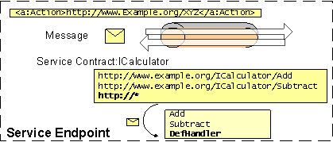
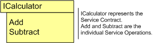
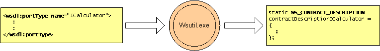

# Contract

A service contract carries metadata that defines how a service to handles channel messages.


A [**WS\_SERVICE\_CONTRACT**](/windows/desktop/api/WebServices/ns-webservices-ws_service_contract) carries metadata for a service to handle a [WS\_MESSAGE](ws-message.md).



It has a [**WS\_CONTRACT\_DESCRIPTION**](/windows/desktop/api/WebServices/ns-webservices-ws_contract_description) and a function table. An application can optionally specify [**WS\_SERVICE\_MESSAGE\_RECEIVE\_CALLBACK**](/windows/desktop/api/WebServices/nc-webservices-ws_service_message_receive_callback).

If a [**WS\_CONTRACT\_DESCRIPTION**](/windows/desktop/api/WebServices/ns-webservices-ws_contract_description) and a function table are not given, the application is required to specify [**WS\_SERVICE\_MESSAGE\_RECEIVE\_CALLBACK**](/windows/desktop/api/WebServices/nc-webservices-ws_service_message_receive_callback).




``` syntax
static WS_SERVICE_CONTRACT calculatorContract = 
{
    &calculatorContractDescription, 
    NULL, 
    &calculatorFunctions, 
};
```

See the [calculator](httpcalculatorserviceexample.md) example for details.

Contract Description

[**WS\_CONTRACT\_DESCRIPTION**](/windows/desktop/api/WebServices/ns-webservices-ws_contract_description) is metadata defining the type-contract of the service. Generated by [wsutil.exe](web-service-compiler-tool.md).

In terms of WSDL, a [**WS\_CONTRACT\_DESCRIPTION**](/windows/desktop/api/WebServices/ns-webservices-ws_contract_description) maps to a wsdl:portType. For each wsdl:portType in the WSDL document a separate **WS\_CONTRACT\_DESCRIPTION** will be generated.

A contract description is made up of on or more [service operations](service-operation.md). These operations are given as an array of [**WS\_OPERATION\_DESCRIPTION**](/windows/desktop/api/WebServices/ns-webservices-ws_operation_description).



``` syntax
<wsdl:definitions xmlns:soap="https://schemas.xmlsoap.org/wsdl/soap/" 
xmlns:wsu="https://docs.oasis-open.org/wss/2004/01/oasis-200401-wss-wssecurity-utility-1.0.xsd" 
xmlns:soapenc="https://schemas.xmlsoap.org/soap/encoding/" xmlns:tns="https://Example.org" 
xmlns:wsa="https://schemas.xmlsoap.org/ws/2004/08/addressing" xmlns:wsp="https://schemas.xmlsoap.org/ws/2004/09/policy" 
xmlns:wsap="https://schemas.xmlsoap.org/ws/2004/08/addressing/policy" xmlns:xsd="https://www.w3.org/2001/XMLSchema" 
xmlns:msc="http://schemas.microsoft.com/ws/2005/12/wsdl/contract" xmlns:wsaw="https://www.w3.org/2006/05/addressing/wsdl" 
xmlns:soap12="https://schemas.xmlsoap.org/wsdl/soap12/" xmlns:wsa10="https://www.w3.org/2005/08/addressing" 
xmlns:wsx="https://schemas.xmlsoap.org/ws/2004/09/mex" targetNamespace="https://Example.org" 
xmlns:wsdl="https://schemas.xmlsoap.org/wsdl/">
 <wsdl:portType name="ICalculator">
  <wsdl:operation name="Add">
   <wsdl:input wsaw:Action="https://Example.org/ICalculator/Add" 
   message="tns:ICalculator_Add_InputMessage" />
   <wsdl:output wsaw:Action="https://Example.org/ICalculator/AddResponse" 
   message="tns:ICalculator_Add_OutputMessage" />
  </wsdl:operation>
 </wsdl:portType>
</wsdl:definitions>
```

For details of wsdl:portType to [**WS\_CONTRACT\_DESCRIPTION**](/windows/desktop/api/WebServices/ns-webservices-ws_contract_description) conversion, see the [WSDL output section](wsdl-support.md).

Example: [**WS\_CONTRACT\_DESCRIPTION**](/windows/desktop/api/WebServices/ns-webservices-ws_contract_description)

``` syntax
static WS_CONTRACT_DESCRIPTION contractDescriptionICalculator =
{
    WsCountOf(serviceOperationsICalculator),
    serviceOperationsICalculator
};
```

Function Table

Function Table is an struct of function pointers representing each of the [service operations](service-operation.md) in the service contract. The function table definition is also generated by [wsutil.exe](web-service-compiler-tool.md).

Example: Function Table

``` syntax
 // Function Table
struct CalculatorServiceFunctionTable
{
      AddOperation Add;
      SubtractOperation Subtract;
};

// Populate the Function Table
static const CalculatorServiceFunctionTable calculatorFunctions = {Add, Subtract};
```

Using the [**WS\_SERVICE\_MESSAGE\_RECEIVE\_CALLBACK**](/windows/desktop/api/WebServices/nc-webservices-ws_service_message_receive_callback)

[**WS\_SERVICE\_MESSAGE\_RECEIVE\_CALLBACK**](/windows/desktop/api/WebServices/nc-webservices-ws_service_message_receive_callback) has a dual mutually exclusive role.

If a [**WS\_CONTRACT\_DESCRIPTION**](/windows/desktop/api/WebServices/ns-webservices-ws_contract_description) is specified on the [**WS\_SERVICE\_CONTRACT**](/windows/desktop/api/WebServices/ns-webservices-ws_service_contract), this becomes the default message handler for all the actions which are not supported by the specified **WS\_CONTRACT\_DESCRIPTION**. Otherwise, if **WS\_CONTRACT\_DESCRIPTION** is not specified on the **WS\_SERVICE\_CONTRACT**, and the [**WS\_SERVICE\_MESSAGE\_RECEIVE\_CALLBACK**](/windows/desktop/api/WebServices/nc-webservices-ws_service_message_receive_callback) is specified on the **WS\_SERVICE\_CONTRACT** all in coming [messages](ws-message.md) are passed to this callback.

For more examples, please see

-   [Untyped service example](untypedserviceexample.md)
-   [Calculator service example](httpcalculatorserviceexample.md)
-   [Service operations](service-operation.md)

The following callbacks are part of the contract:

-   [**WS\_SERVICE\_MESSAGE\_RECEIVE\_CALLBACK**](/windows/desktop/api/WebServices/nc-webservices-ws_service_message_receive_callback)
-   [**WS\_SERVICE\_STUB\_CALLBACK**](/windows/desktop/api/WebServices/nc-webservices-ws_service_stub_callback)

The following structures are part of the contract:

-   [**WS\_CONTRACT\_DESCRIPTION**](/windows/desktop/api/WebServices/ns-webservices-ws_contract_description)
-   [**WS\_SERVICE\_CONTRACT**](/windows/desktop/api/WebServices/ns-webservices-ws_service_contract)

 

 


