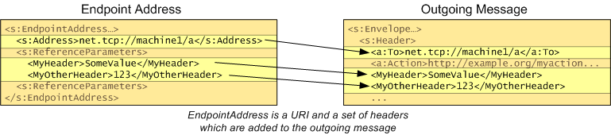

# Endpoint Address

An endpoint address represents the address of a service on the network. When you open a [channel](channel.md), by calling the [**WsOpenChannel**](/windows/desktop/api/WebServices/nf-webservices-wsopenchannel) function, you need to provide the endpoint address of the service you which to communicate with, as well as specifying the channel you wish to open.

An endpoint address consists of:

-   a [URL](url.md)
-   a set of headers (optional)
-   a set of extensions (optional)
-   an optional [identity](endpoint-identity.md) representing the security identity of the service.

When a message is addressed, the URL becomes the "To" header of the message. Any headers that are part of the endpoint address are also added to the message.

Channels automatically address any messages that are sent, using the [**WS\_ENDPOINT\_ADDRESS**](/windows/desktop/api/WebServices/ns-webservices-ws_endpoint_address) structure that was passed to the [**WsOpenChannel**](/windows/desktop/api/WebServices/nf-webservices-wsopenchannel). You can also use the [**WsAddressMessage**](/windows/desktop/api/WebServices/nf-webservices-wsaddressmessage) function to override this default behavior.

When [**WS\_ENDPOINT\_ADDRESS**](/windows/desktop/api/WebServices/ns-webservices-ws_endpoint_address) is passed as a parameter, the [**WsOpenChannel**](/windows/desktop/api/WebServices/nf-webservices-wsopenchannel) and [**WsOpenServiceProxy**](/windows/desktop/api/WebServices/nf-webservices-wsopenserviceproxy) functions create a copy of the **WS\_ENDPOINT\_ADDRESS** parameter in memory and its size is limited by 65536 bytes. [**WsAddressMessage**](/windows/desktop/api/WebServices/nf-webservices-wsaddressmessage) does not have this limitation because it does not require creating a copy of the **WS\_ENDPOINT\_ADDRESS** parameter.

The extensions specified in the **extensions** field of [**WS\_ENDPOINT\_ADDRESS**](/windows/desktop/api/WebServices/ns-webservices-ws_endpoint_address) are not used for addressing the message but instead are an extensibility mechanism that can be used to provide additional information (for example, metadata) about the service. Common extensions can be read with the [**WsReadEndpointAddressExtension**](/windows/desktop/api/WebServices/nf-webservices-wsreadendpointaddressextension) function.

The optional identity field of the endpoint address can include, for example, the DNS name of the machine on which the service is running, or the UPN of the Windows account under which the service is running. The identity field is not used in addressing the message, but may be used for obtaining a security token for the service (for example, for obtaining a Kerberos ticket to the target UPN) and for verifying the identity of the service replies (for example, a DNS identity used for name checks on the service certificate returned during SSL).

Endpoint addresses can be read and written using [serialization](serialization.md) with the **WS\_ENDPOINT\_ADDRESS\_TYPE** enumeration value from [**WS\_TYPE**](/windows/desktop/api/WebServices/ne-webservices-ws_type). Note in order to serialize an endpoint address, you must know the version of the specification used for the addressing headers, as specified in the [**WS\_ADDRESSING\_VERSION**](/windows/desktop/api/WebServices/ne-webservices-ws_addressing_version) enumeration.

 

 

