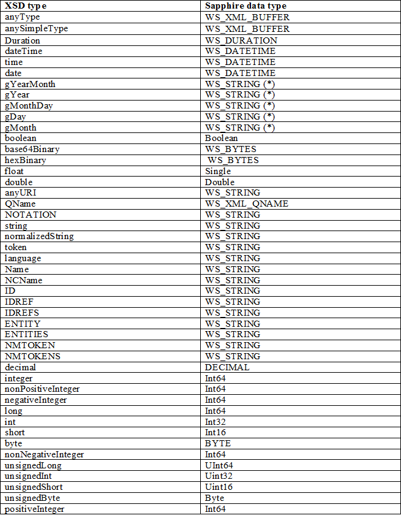

# Schema support level

This section covers the details around the level of schema support.

The schema directly supports the following:

-   Sequences of elements.
-   Derivation of element types.
-   Simple choices of elements (those that map to a tagged union).
-   Basic types defined by XSD / .NET binary format including ranges (min/max).
-   Simple support for any element (no restrictions on type of element).
-   Optional elements and attributes with default values.
-   Repeating elements with ranges (min/max).
-   Nillable elements.

The schema does not support the following directly (which imply the "fallback" behavior):

-   User defined basic types.
-   More complicated choices.
-   Rejecting unknown attributes.
-   Round tripping unknown attributes.
-   More complicated support for any element.
-   The all construct.
-   Key/keyref.

Following is a detailed breakdown of different schema component support. It is compared with data contract in WCF because the similarity in functionality. The difference will be described.

Generally, for fallback behaviors:

-   attributes are fall backed to WS\_STRING;
-   element content are fall backed to WS\_XML\_BUFFER.
-   complexType are fall backed to structure containing a field of WS\_XML\_BUFFER.
-   Simple types are fall backed to WS\_STRING.

wsutil generates warnings for schema components that are not currently fully supported. Application might need to do additional verification for those components are needed. Overtime wsutil can be improved to handle some of the features that are currently supported in runtime, like default value support. wsutil can also be improved together with serialization to support other features like abstract. The number of unsupported schema components can be reduced over time.

## The Overall Schema Document

Global definition that might affect embedded definitions in the schema. These are global attributes that are applicable to all definitions in the schema.

<xs:schema> attributes

-   attributeFromDefault Ignored.
-   blockDefault Ignored.
-   elementFormDefault Ignored. This is different from dataContract as unqualified elements are supported in runtime.
-   finalDefault Ignored. There is no C language support for the concept of final.
-   id Ignored.
-   targetNamespace Supported and mapped to the service namespace.
-   version Ignored.

<xs:schema> contents

-   include Supported; wsutil requires all necessary definition be available as input files during compilation time.
-   redefine Ignored. wsutil does not support this.
-   import Supported; wsutil requires all necessary definition be available as input files during compilation time.
-   simpleType Supported- see simple type section below.
-   complexType Supported- see 'complexType' section
-   group Ignored.
-   attributeGroup Ignored.
-   element Supported; maps to global element definitions.
-   attribute Supported; maps to global attribute definitions.
-   notation Ignored

## Complex Type

Complex type, represented by <xs:complexType>, could be restriction of simple type or complex type, extension of simple type, arrays or structure. Noticed that in extension of simple types, there is no inheritance and no xsi:type support.

<xs:complexType> attributes

-   abstract Generate warning about unsupported feature, no change to code generation.
-   block Generate warning about unsupported feature, no change to code generation.
-   final Generate warning about unsupported feature, no change to code generation.
-   id Ignored.
-   mixed Generate warning about unsupported feature, fallback to structure with WS\_XML\_BUFFER if true.
-   name Supported and mapped to structure type name.

<xs:complexType> contents

This is type definition for structure. complexContent restriction is not supported.

-   complexContent Support complex content extension. Maps to structure inheritance.
-   group Currently fallback to structure with WS\_XML\_BUFFER field. Can be supported according to the underneath particle.
-   choice supported as union. This is not supported in data contract.
-   sequence Supported - maps to fields of a structure
-   attribute supported with one exception of 'prohibited'. fallback to structure with WS\_XML\_BUFFER if 'prohibited'.
-   attributeGroup supported - maps to sequence of attributes
-   anyAttribute Ignored
-   AttributeGroupRef Supported - maps to sequence of attributes.
-   GroupRef Currently fallback to structure with WS\_XML\_BUFFER field. Can be supported according to the underneath group.
-   Any Supported, maps to XML\_BUFFER
-   (blank) supported map to empty struct description with no struct generated.

<xs:sequence> in a complex type: contents

wsutil only fully support sequence of minOccurs = 1 and maxOccurs = 1; otherwise the complex type is currently fall backed to WS\_XML\_BUFFER. It can be supported as array of structures.

-   element Supported; each instance maps to a field in the structure.
-   Group fallback; the complexType is fallback to WS\_XML\_BUFFER.
-   All fallback; the complexType is fallback to WS\_XML\_BUFFER.
-   choice supported; map to union field.
-   sequence fallback; the complexType is fallback to WS\_XML\_BUFFER.
-   any Supported; mapped to XML\_BUFFER.
-   (blank) supported; complexType can be an empty structure if there is no attributes.

## Elements

<xs:element>may occur in three contexts.

-   It may occur within an <xs:sequence>, describing a field of a regular struct. In this case, the maxOccurs attribute must be 1. The field is optional if minOccurs is 0.
-   It may occur within an <xs:sequence>, describing a field of an array. In this case, the maxOccurs attribute must be greater than 1 or 'unbounded'.
-   It may occur within an <xs:schema> as a global element description.

<xs:element> within an <xs:sequence> or <xs:choice> as a field in a structure

-   ref Supported; resolved to reference to global element.
-   name Supported, maps to field name.
-   type Supported, maps to field type. For more information, see 'Type Mapping'. If not specified (and the element does not contain an anonymous type), xs:anyType is assumed.
-   block Generate warning about unsupported feature, no change to code generation.
-   default Generate warning about unsupported feature, no change to code generation.
-   fixed Generate warning about unsupported feature, no change to code generation.
-   form Ignored. Our serialization layer supports both qualified and unqualified forms.
-   id Ignored.
-   maxOccurs maps to a single data field if equals 1. it is mapped to an array field (repeating element) if maxOccurs is larger than 1.
-   minOccurs if 0, the field options is set to FIELD\_OPTIONAL, if nillable is not set.
-   nillable The field is nillable. See [Serialization](serialization.md) for more detail.

<xs:element> as global element: attributes

minOccurs and maxOccurs attributes are invalid as global element description. Application can use generated element description in serialization layer or channel layers directly.

-   abstract Generate warning about unsupported feature, no change to code generation.
-   block Generate warning about unsupported feature, no change to code generation.
-   default Generate warning about unsupported feature, no change to code generation.
-   final Generate warning about unsupported feature, no change to code generation.
-   fixed Generate warning about unsupported feature, no change to code generation.
-   id Ignored.
-   name Supported- map to name of the global element description, and it is the base for the anonymous type when specified.
-   nillable Ignored-application needs to call with right flag.
-   substitutionGroup fallback to structure with WS\_XML\_BUFFER if set. wsutil does not support substitutionGroup.
-   type Supported and map to the type of the element.

<xs:element> as global element: contents

-   simpleType Supported; maps to type definition.
-   complexType supported; maps to a complex type.
-   unique Generate warning about unsupported feature, no change to code generation. wsutil does not support element constraints.
-   key Generate warning about unsupported feature, no change to code generation. wsutil does not support element constraints.
-   keyref Generate warning about unsupported feature, no change to code generation. wsutil does not support element constraints.
-   (blank) Supported; element with no type specification is treated as xs:anyType.

## Simple Types

<xs:simpleType> attributes

-   Final Generate warning about unsupported feature, no change to code generation.
-   Id Ignored
-   Name Supported, maps to type name.

<xs:simpleType> contents

-   Restriction Supported, maps to enum type or range. See "xs:simpleType restrictions" section.
-   List Generate warning about unsupported feature, fallback to XML\_BUFFER.
-   Union Generate warning about unsupported feature, fallback to XML\_BUFFER.

## Simple Type restriction

Certain facets are allowed in integral types and strings type to allow range and enum support.

enumeration support

<xs:enumeration> simple type restriction for base type of string is treated as enum type. In this case, the Base attribute MUST be string type. In enumeration case, all other facets are ignored.

range on simple type support

Some facets are support in simple types support effectively range allowed on the type. Following are restriction for integral types and float/double types. Simple types with other facets are fall backed to WS\_STRING type

-   minExclusive Supported
-   minInclusive Supported
-   maxExclusive Supported
-   maxInclusive Supported
-   totalDigits Generate warning about unsupported feature, no change to code generation.
-   fractionDigits Generate warning about unsupported feature, no change to code generation.
-   length Generate warning about unsupported feature, no change to code generation.
-   minLength Generate warning about unsupported feature, no change to code generation.
-   maxLength Generate warning about unsupported feature, no change to code generation.
-   enumeration Generate warning about unsupported feature, no change to code generation.
-   whiteSpace Generate warning about unsupported feature, no change to code generation.
-   pattern Generate warning about unsupported feature, no change to code generation.
-   (blank) Supported.

minLength and maxLength on string is not supported currently but is a desirable feature to support.

## Inheritance

Wsutil supports inheritance of complex types, that is, a structure can inherit from another structure, similar to interface inheritance in C++. This is done through <xs:complexContentExtension>. <xs:simpleContentExtension> is supported but is generated as plain structure with base type as first field instead of type inheritance.

## Type/primitive mapping

Identifiers needs to be normalized when translating from NCNames in XML. Strings are nillable; pointer types are nillable; integral types and float/double are nillable and defaultValue is set to 0.

 

 

