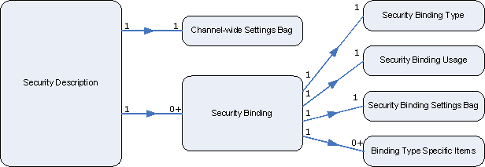

# Security Description

A security desciption is represented by a [**WS\_SECURITY\_DESCRIPTION**](/windows/desktop/api/WebServices/ns-webservices-ws_security_description) structure, and an instance of a security description is supplied when you call the [**WsCreateChannel**](/windows/desktop/api/WebServices/nf-webservices-wscreatechannel) function to create a secure channel or the [**WsCreateListener**](/windows/desktop/api/WebServices/nf-webservices-wscreatelistener) function to create a listener.

## Structure of a Security Description

The basic model of channel security is that a channel is secured with one or more security tokens. Reflecting this model, the [**WS\_SECURITY\_DESCRIPTION**](/windows/desktop/api/WebServices/ns-webservices-ws_security_description) structure contains a list of security bindings, represented by [**WS\_SECURITY\_BINDING**](/windows/desktop/api/WebServices/ns-webservices-ws_security_binding) structures, and each security binding describes how one security token is obtained and used on the channel. The kind of security used on a channel is decided by the selection of security binding subtypes that are included in the security description.

Optional security settings that are specific to a security binding are specified as [security binding settings](security-binding-settings.md) in the security binding structure; however, channel-wide settings independent of security bindings are directly specified as [security channel settings](security-channel-settings.md) in the **properties** field of the security description itself.

The following API elements are used with security descriptions.

| Structure                                                    | Description                                                                                                                              |
|--------------------------------------------------------------|------------------------------------------------------------------------------------------------------------------------------------------|
| [**WS\_SECURITY\_DESCRIPTION**](/windows/desktop/api/WebServices/ns-webservices-ws_security_description) | The top-level structure used to specify the security requirements for a channel (on the client side) or a listener (on the server side). |

 

 

 

