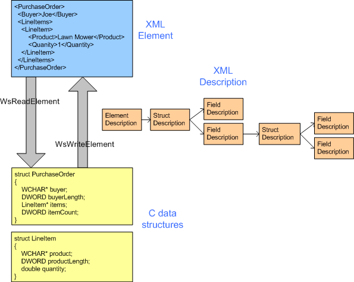

# Serialization

Serialization is the process of writing values in C data structures (structs, arrays, and primitive values) as an XML element. Deserialization is the reverse process.

Serialization is the process of writing values in C data structures (structures, arrays, and primitive values) as an XML element. Deserialization is the reverse process.

Both processes rely on a description of the mapping between the C data structures and the XML.

To serialize a value, the application calls [**WsWriteElement**](/windows/desktop/api/WebServices/nf-webservices-wswriteelement), [**WsWriteAttribute**](/windows/desktop/api/WebServices/nf-webservices-wswriteattribute) or [**WsWriteType**](/windows/desktop/api/WebServices/nf-webservices-wswritetype).

To deserialize a value, the application calls [**WsReadElement**](/windows/desktop/api/WebServices/nf-webservices-wsreadelement), [**WsReadAttribute**](/windows/desktop/api/WebServices/nf-webservices-wsreadattribute) or [**WsReadType**](/windows/desktop/api/WebServices/nf-webservices-wsreadtype).

## Security

[XML Reader](xml-reader.md) is used in deserialization process. Refer to the security section in XML Reader for XML related security information.

The deserializer continues to deserialize data until it has completed reading the element being deserialized. Deserialization process fails when it encounter any XML document that does not conform to the description of the data being deserialized. At that point XML reader being used becomes invalid, and an error is returned.

By default deserialization is strict. Some conditions that cause deserialization to fail include but not limited to:

-   Expected elements is missing
-   Unexpected element fields appear between required elements
-   Extra element content after required fields, unless the **WS_STRUCT_IGNORE_TRAILING_ELEMENT_CONTENT**
-   Unexpected attributes, unless [**WS\_STRUCT\_IGNORE\_UNHANDLED\_ATTRIBUTES**](https://msdn.microsoft.com/library/Dd323454(v=VS.85).aspx) flag is specified
-   Unexpected data type value that is out of specified range
-   Count of repeating element is out of the specified range

Serializing large amount of data might cause excessive memory allocation and can cause denial of service attack. The user that is deserializing data must specify a Heap object to allocate the data, and the user can use the heap allocation limit to prevent memory allocation attack.

Range support for data types, including max length for string, max element count in array, etc. allows the user to control the maximum size for different data types. User can specify range in data description or schema to limit the maximum size of different data.

A string value containing an embedded zero is supported in the wire formats (text, binary, MTOM). When deserializing a string with an embedded zero, the user should use a counted string (WS\_STRING) so the zero will not confuse the calculation of the length of the string. If a string value containing an embedded zero is deserialized into a field that is expecting a zero-terminated string, an error is returned, and deserialization fails. If wsutil is used to generate data descriptions, /string:WS\_STRING option should be used if string with embedded zero is expected.

The following callbacks are used with serialization:

-   [**WS\_DURATION\_COMPARISON\_CALLBACK**](/windows/desktop/api/WebServices/nc-webservices-ws_duration_comparison_callback)
-   [**WS\_READ\_TYPE\_CALLBACK**](/windows/desktop/api/WebServices/nc-webservices-ws_read_type_callback)
-   [**WS\_WRITE\_TYPE\_CALLBACK**](/windows/desktop/api/WebServices/nc-webservices-ws_write_type_callback)

The following enumerations are used with serialization:

-   [**WS\_FIELD\_MAPPING**](/windows/desktop/api/WebServices/ne-webservices-ws_field_mapping)
-   [**WS\_FIELD\_OPTIONS**](/windows/win32/api/webservices/ne-webservices-ws_xml_reader_encoding_type)
-   [**WS\_READ\_OPTION**](/windows/desktop/api/WebServices/ne-webservices-ws_read_option)
-   [**WS\_TYPE**](/windows/desktop/api/WebServices/ne-webservices-ws_type)
-   [**WS\_TYPE\_MAPPING**](/windows/desktop/api/WebServices/ne-webservices-ws_type_mapping)
-   [**WS\_WRITE\_OPTION**](/windows/desktop/api/WebServices/ne-webservices-ws_write_option)

The following functions are used with serialization:

-   [**WsReadAttribute**](/windows/desktop/api/WebServices/nf-webservices-wsreadattribute)
-   [**WsReadElement**](/windows/desktop/api/WebServices/nf-webservices-wsreadelement)
-   [**WsReadType**](/windows/desktop/api/WebServices/nf-webservices-wsreadtype)
-   [**WsWriteAttribute**](/windows/desktop/api/WebServices/nf-webservices-wswriteattribute)
-   [**WsWriteElement**](/windows/desktop/api/WebServices/nf-webservices-wswriteelement)
-   [**WsWriteType**](/windows/desktop/api/WebServices/nf-webservices-wswritetype)

The following structures are used with serialization:

-   [**WS\_ATTRIBUTE\_DESCRIPTION**](/windows/desktop/api/WebServices/ns-webservices-ws_attribute_description)
-   [**WS\_BOOL\_DESCRIPTION**](/windows/desktop/api/WebServices/ns-webservices-ws_bool_description)
-   [**WS\_BYTES\_DESCRIPTION**](/windows/desktop/api/WebServices/ns-webservices-ws_bytes_description)
-   [**WS\_BYTE\_ARRAY\_DESCRIPTION**](/windows/desktop/api/WebServices/ns-webservices-ws_byte_array_description)
-   [**WS\_CHAR\_ARRAY\_DESCRIPTION**](/windows/desktop/api/WebServices/ns-webservices-ws_char_array_description)
-   [**WS\_CUSTOM\_TYPE\_DESCRIPTION**](/windows/desktop/api/WebServices/ns-webservices-ws_custom_type_description)
-   [**WS\_DATETIME\_DESCRIPTION**](/windows/desktop/api/WebServices/ns-webservices-ws_datetime_description)
-   [**WS\_DECIMAL\_DESCRIPTION**](/windows/desktop/api/WebServices/ns-webservices-ws_decimal_description)
-   [**WS\_DEFAULT\_VALUE**](/windows/desktop/api/WebServices/ns-webservices-ws_default_value)
-   [**WS\_DOUBLE\_DESCRIPTION**](/windows/desktop/api/WebServices/ns-webservices-ws_double_description)
-   [**WS\_DURATION\_DESCRIPTION**](/windows/desktop/api/WebServices/ns-webservices-ws_duration_description)
-   [**WS\_ELEMENT\_DESCRIPTION**](/windows/desktop/api/WebServices/ns-webservices-ws_element_description)
-   [**WS\_ENDPOINT\_ADDRESS\_DESCRIPTION**](/windows/desktop/api/WebServices/ns-webservices-ws_endpoint_address_description)
-   [**WS\_ENUM\_DESCRIPTION**](/windows/desktop/api/WebServices/ns-webservices-ws_enum_description)
-   [**WS\_ENUM\_VALUE**](/windows/desktop/api/WebServices/ns-webservices-ws_enum_value)
-   [**WS\_FAULT\_DESCRIPTION**](/windows/desktop/api/WebServices/ns-webservices-ws_fault_description)
-   [**WS\_FIELD\_DESCRIPTION**](/windows/desktop/api/WebServices/ns-webservices-ws_field_description)
-   [**WS\_FLOAT\_DESCRIPTION**](/windows/desktop/api/WebServices/ns-webservices-ws_float_description)
-   [**WS\_GUID\_DESCRIPTION**](/windows/desktop/api/WebServices/ns-webservices-ws_guid_description)
-   [**WS\_INT16\_DESCRIPTION**](/windows/desktop/api/WebServices/ns-webservices-ws_int16_description)
-   [**WS\_INT32\_DESCRIPTION**](/windows/desktop/api/WebServices/ns-webservices-ws_int32_description)
-   [**WS\_INT64\_DESCRIPTION**](/windows/desktop/api/WebServices/ns-webservices-ws_int64_description)
-   [**WS\_INT8\_DESCRIPTION**](/windows/desktop/api/WebServices/ns-webservices-ws_int8_description)
-   [**WS\_ITEM\_RANGE**](/windows/desktop/api/WebServices/ns-webservices-ws_item_range)
-   [**WS\_STRING\_DESCRIPTION**](/windows/desktop/api/WebServices/ns-webservices-ws_string_description)
-   [**WS\_STRUCT\_DESCRIPTION**](/windows/desktop/api/WebServices/ns-webservices-ws_struct_description)
-   [**WS\_TIMESPAN\_DESCRIPTION**](/windows/desktop/api/WebServices/ns-webservices-ws_timespan_description)
-   [**WS\_UINT16\_DESCRIPTION**](/windows/desktop/api/WebServices/ns-webservices-ws_uint16_description)
-   [**WS\_UINT32\_DESCRIPTION**](/windows/desktop/api/WebServices/ns-webservices-ws_uint32_description)
-   [**WS\_UINT64\_DESCRIPTION**](/windows/desktop/api/WebServices/ns-webservices-ws_uint64_description)
-   [**WS\_UINT8\_DESCRIPTION**](/windows/desktop/api/WebServices/ns-webservices-ws_uint8_description)
-   [**WS\_UNION\_DESCRIPTION**](/windows/desktop/api/WebServices/ns-webservices-ws_union_description)
-   [**WS\_UNION\_FIELD\_DESCRIPTION**](/windows/desktop/api/WebServices/ns-webservices-ws_union_field_description)
-   [**WS\_UNIQUE\_ID\_DESCRIPTION**](/windows/desktop/api/WebServices/ns-webservices-ws_unique_id_description)
-   [**WS\_UTF8\_ARRAY\_DESCRIPTION**](/windows/desktop/api/WebServices/ns-webservices-ws_utf8_array_description)
-   [**WS\_VOID\_DESCRIPTION**](/windows/desktop/api/WebServices/ns-webservices-ws_void_description)
-   [**WS\_WSZ\_DESCRIPTION**](/windows/desktop/api/WebServices/ns-webservices-ws_wsz_description)
-   [**WS\_XML\_QNAME\_DESCRIPTION**](/windows/desktop/api/WebServices/ns-webservices-ws_xml_qname_description)
-   [**WS\_XML\_STRING\_DESCRIPTION**](/windows/desktop/api/WebServices/ns-webservices-ws_xml_string_description)

 

 

