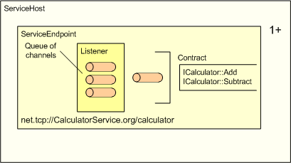

# Service Host

The service host is the runtime environment for hosting a service within a process.


A service can configure one or more endpoints inside a service host.



## Creating a service host

Before creating a service host, a service needs to define its endpoints. An endpoint in service host is specified in the [**WS\_SERVICE\_ENDPOINT**](/windows/desktop/api/WebServices/ns-webservices-ws_service_endpoint) structure and it is defined by the following information:

-   An address, which is the physical URI on which the service will be hosted.
-   A [**WS\_CHANNEL\_TYPE**](/windows/desktop/api/WebServices/ne-webservices-ws_channel_type) structure that specifies the type of the underlying channel for the endpoint.
-   A [**WS\_CHANNEL\_BINDING**](/windows/desktop/api/WebServices/ne-webservices-ws_channel_binding) structure that specifies the binding of the channel.
-   A [**WS\_SECURITY\_DESCRIPTION**](/windows/desktop/api/WebServices/ns-webservices-ws_security_description) structure that contains the security description for the endpoint.
-   A [**WS\_SERVICE\_CONTRACT**](/windows/desktop/api/WebServices/ns-webservices-ws_service_contract) structure that represents the [service contract](contract.md) for the endpoint.
-   A [**WS\_SERVICE\_SECURITY\_CALLBACK**](/windows/desktop/api/WebServices/nc-webservices-ws_service_security_callback) structure that specifies an authorization callback function for the endpoint.
-   A [**WS\_SERVICE\_ENDPOINT\_PROPERTY**](/windows/desktop/api/WebServices/ns-webservices-ws_service_endpoint_property) structure that contains an array of service endpoint properties.

``` syntax
WS_SERVICE_ENDPOINT serviceEndpoint = {0};
const WS_SERVICE_ENDPOINT* serviceEndpoints[1];
serviceEndpoints[0] = &serviceEndpoint;
WS_STRING url = WS_STRING_VALUE(L"net.tcp://+/Example");

// Method based service contract for the service
static WS_SERVICE_CONTRACT calculatorContract = 
{
    &calculatorContractDescription, // comes from a generated header.
    NULL,
    &calculatorFunctions, // specified by the application
};

serviceEndpoint.address.url = &url;
serviceEndpoint.binding.channelBinding =  WS_TCP_CHANNEL_BINDING; 
serviceEndpoint.contract = &calculatorContract;  
serviceEndpoint.channelType = WS_CHANNEL_TYPE_DUPLEX_SESSION; 
serviceEndpoint.authorizationCallback = AuthorizationCallback; // Authorization callback.
```

Only one-way contracts are supported for SOAP over UDP, represented by [**WS\_UDP\_CHANNEL\_BINDING**](/windows/desktop/api/WebServices/ne-webservices-ws_channel_binding) in the **WS\_CHANNEL\_BINDING** enumeration.

After an endpoint is defined, it can be passed to the [**WsCreateServiceHost**](/windows/desktop/api/WebServices/nf-webservices-wscreateservicehost) function, which takes an array of pointers to [**WS\_SERVICE\_ENDPOINT**](/windows/desktop/api/WebServices/ns-webservices-ws_service_endpoint) structures.

``` syntax
HRESULT hr = WsCreateServiceHost (serviceEndpoints, 1, NULL, 0, &host, error);
```

An application can optionally provide an array of [**service properties**](/windows/desktop/api/WebServices/ns-webservices-ws_service_property) to [**WsCreateServiceHost**](/windows/desktop/api/WebServices/nf-webservices-wscreateservicehost) to configure custom settings on the service host.

An application opens the service host to start accepting client requests.

``` syntax
WsOpenServiceHost(serviceHost, NULL, NULL);
```

After opening the service host, the application can close it if there are no more operations that require it. Note that this does not release its resources, and that it can be reopened with a subsequent call to [**WsResetServiceHost**](/windows/desktop/api/WebServices/nf-webservices-wsresetservicehost).

``` syntax
WsCloseServiceHost(serviceHost, NULL, NULL);
```

After closing the service host, an application may reset the service host for reuse.

``` syntax
WsResetServiceHost(serviceHost, NULL);
```

When the application is done with the service host it can free the resources associated with the service host by calling the [**WsFreeServiceHost**](/windows/desktop/api/WebServices/nf-webservices-wsfreeservicehost) function. Note that [**WsCloseServiceHost**](/windows/desktop/api/WebServices/nf-webservices-wscloseservicehost) must be called before calling this function.

``` syntax
WsFreeServiceHost(serviceHost, NULL);
```

For information on attaching a custom state to the service host, see [User Host State](user-host-state.md)

For information on authorization in a service host for a given endpoint, see [Service Authorization](service-authorization.md).

For iinformation on implementing service operations and service contracts for a service, see the [service operations](server-side-service-operations.md) and [service contract](contract.md)topics.

## Security

An application can use the followin properties to control the amount of resources the service host allocates on behalf of the application:

-   [**WS\_SERVICE\_ENDPOINT\_PROPERTY\_MAX\_ACCEPTING\_CHANNELS**](/windows/desktop/api/WebServices/ne-webservices-ws_service_endpoint_property_id),
-   [**WS\_SERVICE\_ENDPOINT\_PROPERTY\_MAX\_CONCURRENCY**](/windows/desktop/api/WebServices/ne-webservices-ws_service_endpoint_property_id),
-   [**WS\_SERVICE\_ENDPOINT\_PROPERTY\_MAX\_CHANNELS**](/windows/desktop/api/WebServices/ne-webservices-ws_service_endpoint_property_id),
-   [**WS\_SERVICE\_ENDPOINT\_PROPERTY\_BODY\_HEAP\_MAX\_SIZE**](/windows/desktop/api/WebServices/ne-webservices-ws_service_endpoint_property_id),
-   [**WS\_SERVICE\_ENDPOINT\_PROPERTY\_MAX\_CALL\_POOL\_SIZE**](/windows/desktop/api/WebServices/ne-webservices-ws_service_endpoint_property_id),
-   [**WS\_SERVICE\_ENDPOINT\_PROPERTY\_MAX\_CHANNEL\_POOL\_SIZE**](/windows/desktop/api/WebServices/ne-webservices-ws_service_endpoint_property_id).

Secure defaults are chosen for each of these properties, an application must be careful if it wishes to modify these properties. Beyond the above-mentioned properties, [channel](channel.md), [listener](listener.md) and [message](message.md) specific properties can also be modified by the application. Refer to the security considerations of these components before modifying any of these settings.

In addition, the following application design considerations should be carefully evaluated when using WWSAPI service host API:

-   When using MEX, applications should be careful not to disclose any sensitive data. As a mitigation, if the nature of the data being exposed through MEX is sensitive, applications may choose to configure the MEX endpoint with a secure binding requiring authentication at the very least and implement authorization as part of the endpoint using the [**WS\_SERVICE\_SECURITY\_CALLBACK**](/windows/desktop/api/WebServices/nc-webservices-ws_service_security_callback).
-   By default rich error information through faults is disabled on service host by [**WS\_SERVICE\_PROPERTY\_FAULT\_DISCLOSURE**](/windows/desktop/api/WebServices/ne-webservices-ws_service_property_id) property. It is upon the discretion of the application to send rich error information as part of the fault. However, this can result in information disclosure and thus it is recommended that this setting is only changed for debugging scenarios.
-   Beyond validation performed for Basic Profile 2.0 and XML serialization, service host performs no validation on the data content received as part of service operation parameters. It is the responsibility of the application to perform all parameter validations on its own.
-   Authorization is not implemented as part of service host. However, applications can implement their own authorization scheme using [**WS\_SECURITY\_DESCRIPTION**](/windows/desktop/api/WebServices/ns-webservices-ws_security_description) and the [**WS\_SERVICE\_SECURITY\_CALLBACK**](/windows/desktop/api/WebServices/nc-webservices-ws_service_security_callback).
-   It is the responsibility of the application to use secure bindings on its endpoint. Service host does not provide any security beyond what is configured on the endpoint.

The following API elements are used with the service host.

| Callback                                                                             | Description                                                                     |
|--------------------------------------------------------------------------------------|---------------------------------------------------------------------------------|
| [**WS\_SERVICE\_ACCEPT\_CHANNEL\_CALLBACK**](/windows/desktop/api/WebServices/nc-webservices-ws_service_accept_channel_callback) | Invoked when a channel is accepted on an endpoint listener by the service host. |
| [**WS\_SERVICE\_CLOSE\_CHANNEL\_CALLBACK**](/windows/desktop/api/WebServices/nc-webservices-ws_service_close_channel_callback)   | Invoked when a channel is closed or aborted on an endpoint.                     |


 


| Enumeration                                                                    | Description                                                                                 |
|--------------------------------------------------------------------------------|---------------------------------------------------------------------------------------------|
| [**WS\_SERVICE\_ENDPOINT\_PROPERTY\_ID**](/windows/desktop/api/WebServices/ne-webservices-ws_service_endpoint_property_id) | Optional parameters for configuring a [**WS\_SERVICE\_ENDPOINT**](/windows/desktop/api/WebServices/ns-webservices-ws_service_endpoint). |
| [**WS\_SERVICE\_HOST\_STATE**](/windows/desktop/api/WebServices/ne-webservices-ws_service_host_state)                      | The states that a service host can be in.                                                   |
| [**WS\_SERVICE\_PROPERTY\_ID**](/windows/desktop/api/WebServices/ne-webservices-ws_service_property_id)                    | Optional parameters for configuring the service host.                                       |


 


| Function                                                     | Description                                                                                  |
|--------------------------------------------------------------|----------------------------------------------------------------------------------------------|
| [**WsAbortServiceHost**](/windows/desktop/api/WebServices/nf-webservices-wsabortservicehost)             | Interrupts and discontinues current operations on the service host.                          |
| [**WsCloseServiceHost**](/windows/desktop/api/WebServices/nf-webservices-wscloseservicehost)             | Closes all listeners so that no new channels are accepted from the client.                   |
| [**WsCreateServiceHost**](/windows/desktop/api/WebServices/nf-webservices-wscreateservicehost)           | Creates a service host.                                                                      |
| [**WsFreeServiceHost**](/windows/desktop/api/WebServices/nf-webservices-wsfreeservicehost)               | Releases the memory associated with a service host object.                                   |
| [**WsGetServiceHostProperty**](/windows/desktop/api/WebServices/nf-webservices-wsgetservicehostproperty) | Retrieves a specified Service Host property.                                                 |
| [**WsOpenServiceHost**](/windows/desktop/api/WebServices/nf-webservices-wsopenservicehost)               | Opens a service host for communication and starts the listeners on all the endpoints.        |
| [**WsResetServiceHost**](/windows/desktop/api/WebServices/nf-webservices-wsresetservicehost)             | Resets the service host for reuse and resets the underlying channel and listeners for reuse. |


 


| Handle                                       | Description                                      |
|----------------------------------------------|--------------------------------------------------|
| [**WS\_SERVICE\_HOST**](ws-service-host.md) | An opaque type used to reference a service host. |


 


| Structure                                                                              | Description                                                                     |
|----------------------------------------------------------------------------------------|---------------------------------------------------------------------------------|
| [**WS\_SERVICE\_ENDPOINT**](/windows/desktop/api/WebServices/ns-webservices-ws_service_endpoint)                                   | Represents an individual endpoint on a service host.                            |
| [**WS\_SERVICE\_ENDPOINT\_PROPERTY**](/windows/desktop/api/WebServices/ns-webservices-ws_service_endpoint_property)                | Specifies a service-specific setting.                                           |
| [**WS\_SERVICE\_PROPERTY**](/windows/desktop/api/WebServices/ns-webservices-ws_service_property)                                   | Specifies a service-specific setting.                                           |
| [**WS\_SERVICE\_PROPERTY\_ACCEPT\_CALLBACK**](/windows/desktop/api/WebServices/ns-webservices-ws_service_property_accept_callback) | Specifies the callback which is called when a channel is successfully accepted. |
| [**WS\_SERVICE\_PROPERTY\_CLOSE\_CALLBACK**](/windows/desktop/api/WebServices/ns-webservices-ws_service_property_close_callback)   | Specifies the callback which is called when a channel is about to be closed.    |


 

 

 


