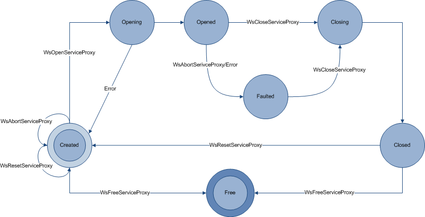

# Service Proxy

A service proxy is the client side proxy for a service. The service proxy enables applications to send and receive [messages](message.md) over a [channel](channel.md) as method calls.

Service proxies are created as needed, opened, used to call a service, and closed when no longer needed. Alternatively, an application may reuse a service proxy to connect repeatedly to the same service without the expenditure of time and resources required for initialising a service proxy more than once. The following diagram illustrates the flow of the possible states of the service proxy and the function calls or events that lead from one state to another.



These service proxy states are enumerated in the [**WS\_SERVICE\_PROXY\_STATE**](/windows/win32/WebServices/ne-webservices-ws_service_proxy_state?branch=master) enumeration.

As the preceding diagram and the following code illustrate, a service proxy is created by a call to the [**WsCreateServiceProxy**](/windows/win32/WebServices/nf-webservices-wscreateserviceproxy?branch=master) function. As parameters for this call, WWSAPI provides the following enumerations:

-   [**WS\_CHANNEL\_TYPE**](/windows/win32/WebServices/ne-webservices-ws_channel_type?branch=master)
-   [**WS\_CHANNEL\_BINDING**](/windows/win32/WebServices/ne-webservices-ws_channel_binding?branch=master)

It also accepts optional parameters using the following data types:

-   [**WS\_PROXY\_PROPERTY\_ID**](/windows/win32/WebServices/ne-webservices-ws_proxy_property_id?branch=master)
-   [**WS\_SECURITY\_DESCRIPTION**](/windows/win32/WebServices/ns-webservices-_ws_security_description?branch=master)

When the service proxy has been created, the **WsCreateServiceProxy** function returns a reference to the service proxy, [WS\_SERVICE\_PROXY](ws-service-proxy.md), through an out parameter.

``` syntax
WS_SERVICE_PROXY* serviceProxy = NULL;
hr = WsCreateServiceProxy (
    WS_TCP_CHANNEL_BINDING, 
    WS_CHANNEL_TYPE_DUPLEX_SESSION, 
    NULL, 
    NULL, 
    0, 
    NULL,
    0,
    &serviceProxy, 
    error);
```

When the service proxy has been created, the application can open the service proxy for communication to a service by calling the [**WsOpenServiceProxy**](/windows/win32/WebServices/nf-webservices-wsopenserviceproxy?branch=master) function, passing an [**address**](/windows/win32/WebServices/ns-webservices-_ws_endpoint_address?branch=master) structure containing the network address of the service endpoint to connect to.

``` syntax
WS_ENDPOINT_ADDRESS address = {0};
address.uri.chars = "net.tcp://localhost/example";
address.uri.length = wcslen("net.tcp://localhost/example";);
hr = WsOpenServiceProxy(serviceProxy, &address, NULL, error);
```

When the service proxy has been opened, the application can use it to make calls to the service.

``` syntax
hr = Add(
    serviceProxy, 
    1, 
    2, 
    &result, 
    NULL, 
    0, 
    NULL, 
    error);
```

When the application no longer needs the service proxy, it closes the service proxy by calling the [**WsCloseServiceProxy**](/windows/win32/WebServices/nf-webservices-wscloseserviceproxy?branch=master) function. It also frees the associated memory by calling [**WsFreeServiceProxy**](/windows/win32/WebServices/nf-webservices-wsfreeserviceproxy?branch=master).

``` syntax
hr = WsCloseServiceProxy(
    serviceProxy, 
    NULL, 
    error);
```

``` syntax
hr = WsFreeServiceProxy(
    serviceProxy, 
    error);
```

## Reusing the Service Proxy

Alternatively, after calling [**WsCloseServiceProxy**](/windows/win32/WebServices/nf-webservices-wscloseserviceproxy?branch=master) an application can reuse the service proxy by calling the [**WsResetServiceProxy**](/windows/win32/WebServices/nf-webservices-wsresetserviceproxy?branch=master) function.

``` syntax
hr = WsResetServiceProxy(
    serviceProxy, 
    error);
```

For more information on how service proxies are used in different contexts, see the following topics:

-   [Service Proxy and Sessions](service-proxy-and-sessions.md)
-   [Service Operation](service-operation.md)
-   [Client Side Service Operations](client-side-service-operations.md)
-   [HttpCalculatorClientExample](httpcalculatorclientexample.md)

### Security

Following application design considerations should be carefully noted when you use the WWSAPI service proxy API:

-   The service proxy will not perform any validation of the data beyond Basic Profile 2.0 validation and XML serialization. It is the responsibility of the application to validate the data contained in the parameters it receives back as part of the call.
-   Configuring the maximum number of pending calls on the service proxy, by using the [**WS\_PROXY\_PROPERTY\_ID**](/windows/win32/WebServices/ne-webservices-ws_proxy_property_id?branch=master) enumeration value **WS\_PROXY\_PROPERTY\_MAX\_PENDING\_CALLS**, provides protection against a slow running server. The default maximum is 100. Applications must be careful in modifying the defaults.
-   The service proxy provides no security guarantees beyond those specified in the [**WS\_SECURITY\_DESCRIPTION**](/windows/win32/WebServices/ns-webservices-_ws_security_description?branch=master) structure used to communicate with the server.
-   Take care when you modifying [message](message.md) and [channel](channel.md) defaults on the service proxy. Read the security considerations associated with messages and channels before you modify any of the related properties.
-   Service proxy encrypts all credentials that it keeps in memory.

The following API elements relate to service proxies.

| Callback                                                          | Description                                                                                                                     |
|-------------------------------------------------------------------|---------------------------------------------------------------------------------------------------------------------------------|
| [**WS\_PROXY\_MESSAGE\_CALLBACK**](/windows/win32/WebServices/nc-webservices-ws_proxy_message_callback?branch=master) | Invoked when the headers of the input message are about to be sent through or when an output message headers are just received. |


 


| Enumeration                                                 | Description                                                                               |
|-------------------------------------------------------------|-------------------------------------------------------------------------------------------|
| [**WS\_CALL\_PROPERTY\_ID**](/windows/win32/WebServices/ne-webservices-ws_call_property_id?branch=master)       | Enumerates optional parameters for configuring a call on a client side service operation. |
| [**WS\_PROXY\_PROPERTY\_ID**](/windows/win32/WebServices/ne-webservices-ws_proxy_property_id?branch=master)     | Enumerates optional parameters for configuring the service proxy.                         |
| [**WS\_SERVICE\_PROXY\_STATE**](/windows/win32/WebServices/ne-webservices-ws_service_proxy_state?branch=master) | The state of the service proxy.                                                           |


 


| Function                                                       | Description                                                                       |
|----------------------------------------------------------------|-----------------------------------------------------------------------------------|
| [**WsAbandonCall**](/windows/win32/WebServices/nf-webservices-wsabandoncall?branch=master)                         | Abandons a specified call on a specified service proxy.                           |
| [**WsAbortServiceProxy**](/windows/win32/WebServices/nf-webservices-wsabortserviceproxy?branch=master)             | Cancels all pending input and output on a specified service proxy.                |
| [**WsCall**](/windows/win32/WebServices/nf-webservices-wscall?branch=master)                                       | Internal only. Serializes arguments into a message and sends it over the channel. |
| [**WsCloseServiceProxy**](/windows/win32/WebServices/nf-webservices-wscloseserviceproxy?branch=master)             | Closes a service proxy for communication.                                         |
| [**WsCreateServiceProxy**](/windows/win32/WebServices/nf-webservices-wscreateserviceproxy?branch=master)           | Creates a service proxy.                                                          |
| [**WsFreeServiceProxy**](/windows/win32/WebServices/nf-webservices-wsfreeserviceproxy?branch=master)               | Releases the memory associated with a service proxy.                              |
| [**WsGetServiceProxyProperty**](/windows/win32/WebServices/nf-webservices-wsgetserviceproxyproperty?branch=master) | Retrieves a specified service proxy property.                                     |
| [**WsOpenServiceProxy**](/windows/win32/WebServices/nf-webservices-wsopenserviceproxy?branch=master)               | Opens a service proxy to a service endpoint.                                      |
| [**WsResetServiceProxy**](/windows/win32/WebServices/nf-webservices-wsresetserviceproxy?branch=master)             | Resets service proxy.                                                             |


 


| Handle                                     | Description                                       |
|--------------------------------------------|---------------------------------------------------|
| [WS\_SERVICE\_PROXY](ws-service-proxy.md) | An opaque type used to reference a service proxy. |


 


| Structure                                         | Description                 |
|---------------------------------------------------|-----------------------------|
| [**WS\_CALL\_PROPERTY**](/windows/win32/WebServices/ns-webservices-_ws_call_property?branch=master)    | Specifies a call property.  |
| [**WS\_PROXY\_PROPERTY**](/windows/win32/WebServices/ns-webservices-_ws_proxy_property?branch=master). | Specifies a proxy property. |


 

 

 


