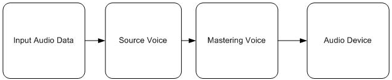

# How to: Build a Basic Audio Processing Graph

The minimum requirement for enabling XAudio2 to play audio data is an audio processing graph, which is constructed from a single mastering voice and a single source voice.

## To build a basic audio processing graph

1.  Initialize the XAudio2 engine by following the steps described in [How to: Initialize XAudio2](how-to--initialize-xaudio2.md).
2.  Populate a **WAVEFORMATEX** and [**XAUDIO2\_BUFFER**](/windows/desktop/api/xaudio2/ns-xaudio2-xaudio2_buffer) structure by following the steps described in [How to: Load Audio Data Files in XAudio2](how-to--load-audio-data-files-in-xaudio2.md).
3.  Create a source voice using the [**CreateSourceVoice**](/windows/win32/api/xaudio2/nf-xaudio2-ixaudio2-createsourcevoice) function.

    When you specify NULL for the pSendList argument of [**CreateSourceVoice**](/windows/win32/api/xaudio2/nf-xaudio2-ixaudio2-createsourcevoice), the source voice's output goes to the mastering voice created in step 1.

    ```
    IXAudio2SourceVoice* pSourceVoice;
    if( FAILED(hr = pXAudio2->CreateSourceVoice( &pSourceVoice, (WAVEFORMATEX*)&wfx,
                  0, XAUDIO2_DEFAULT_FREQ_RATIO, NULL, NULL, NULL ) ) ) return hr;
    ```

    

    After you finish this step, there is a simple audio graph consisting of the source voice, the mastering voice, and the audio device. The remaining steps in this how-to topic show you how to start audio data flowing through the graph.

    A simple audio graph

    

4.  Use the function [**SubmitSourceBuffer**](/windows/win32/api/xaudio2/nf-xaudio2-ixaudio2sourcevoice-submitsourcebuffer) to submit an [**XAUDIO2\_BUFFER**](/windows/desktop/api/xaudio2/ns-xaudio2-xaudio2_buffer) to the source voice.

    ```
    if( FAILED(hr = pSourceVoice->SubmitSourceBuffer( &buffer ) ) )
        return hr;
    ```

    

5.  Use the [**Start**](/windows/win32/api/xaudio2/nf-xaudio2-ixaudio2sourcevoice-start) function to start the source voice.

    ```
    if ( FAILED(hr = pSourceVoice->Start( 0, XAUDIO2_COMMIT_NOW ) ) )
        return hr;
    ```

    

## Related topics

<dl> <dt>

[Audio Graphs](audio-graphs.md)
</dt> <dt>

[XAudio2 Programming Guide](programming-guide.md)
</dt> </dl>

 

 
