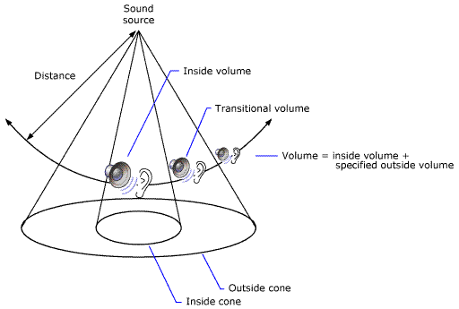

# Sound Cones

A model that describes the loudness of oriented sound.

A sound with no orientation has the same amplitude at a given distance in all directions. A sound with an orientation is loudest in the direction of orientation. The model that describes the loudness of the oriented sound is called a sound cone. Sound cones are made up of an inside (or inner) cone and an outside (or outer) cone. The outside cone angle must always be equal to or greater than the inside cone angle.

At any angle within the inner cone, the volume of the sound is set to the inner cone volume. This takes into account the basic volume of the buffer, the distance from the listener, the listener's orientation if the listener has its own cone, and so on.

At any angle outside the outer cone, the normal volume is attenuated by a factor set by the application. The outside cone volume level is expressed as a linear amplitude scaler: 1.0 f represents no attenuation applied to the original signal, 0.5 f denotes an attenuation of 6 dB, and 0.0 f results in silence. Amplification (volume > 1.0 f) is also allowed, and is not clamped. The valid volume range is actually 0.0 f to 2.0 f.

Between the inner and outer cones is a zone of transition from the inside volume to the outside volume. The volume approaches the cone's outer volume as the angle increases.

Cones can affect parameters other than volume. Low pass filter and reverb send level may also be affected, making the technique even more dramatic. For example, with a cone on the listener, one can specify all sounds behind the listener get a bit muffled, and have slightly higher reverb-to-direct ratio content. These provide more cues that the sound is behind the user. This enhances realism.

The following illustration shows the concept of sound cones.

Designing sound cones properly can add dramatic effects to your application. For example, you could position a sound source in the center of a room, setting its orientation toward an open door in a hallway. Then set the angle of the inside cone so that it extends to the width of the doorway, make the outside cone a bit wider, and finally set the outside cone volume to inaudible. A listener moving along the hallway will begin to hear the sound only when near the doorway. The sound will be loudest as the listener passes in front of the open door.

## Related topics

<dl> <dt>

[Common Audio Concepts](common-audio-concepts.md)
</dt> <dt>

[X3DAudio](x3daudio-overview.md)
</dt> <dt>

[**X3DAUDIO\_CONE**](/windows/desktop/api/x3daudio/ns-x3daudio-x3daudio_cone)
</dt> </dl>

 

 

