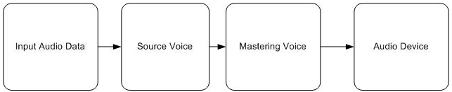

# XAudio2 Audio Graph

The set of all voices, with their contained effects and their interconnections, is referred to as the audio processing graph. The graph takes a set of audio streams from the client as input, processes them, and delivers the final result to an audio device. All audio processing takes place in a separate thread with a periodicity defined by the graph's quantum (currently 10 milliseconds on Microsoft Windows, and 5 1/3 milliseconds on Xbox 360). Every quantum milliseconds, the thread wakes up and disperses quantum milliseconds of audio data through the entire graph. For an example of building a basic audio graph, see How to: [Build a Basic Audio Processing Graph](how-to--build-a-basic-audio-processing-graph.md).

A simple audio graph:

The client can control the graph's state dynamically while it is running. Control actions might include adding and removing inputs and outputs, changing the internal effects and interconnections, setting parameters on the effects, enabling and disabling parts of the graph, and so on. For an example of dynamically changing an audio graph, see [How to: Dynamically Add or Remove Voices From an Audio Graph](how-to--dynamically-add-or-remove-voices-from-an-audio-graph.md).

## Processing the Graph

Any method call that affects any object in the graph is considered to be effecting a graph state change. Graph state changes include the following:

-   Creating and destroying voices
-   Starting or stopping voices
-   Changing the destinations of a voice
-   Modifying effect chains
-   Enabling or disabling effects
-   Setting parameters on the effects or on the built-in SRCs, filters, volumes, and mixers

Any set of graph state changes can be combined and performed as an atomic transaction. These atomic operations are known as operation sets. They are discussed in the [XAudio2 Operation Sets](xaudio2-operation-sets.md) overview.

## Internal Data Representation

Audio data within the XAudio2 graph is always stored and processed in 32-bit floating-point PCM form. However, the channel count and sample rate can vary within the graph. The format in which a given voice processes audio is determined by the voice type and parameters used to create the voice.

| Voice Type                                                                                                      | Parameters                                                                                     |
|-----------------------------------------------------------------------------------------------------------------|------------------------------------------------------------------------------------------------|
| [**IXAudio2SourceVoice**](/windows/desktop/api/xaudio2/nn-xaudio2-ixaudio2sourcevoice)                                                              | The channel count and sample rate of the voices to which the source voice sends audio.         |
| [**IXAudio2SubmixVoice**](/windows/desktop/api/xaudio2/nn-xaudio2-ixaudio2submixvoice) and [**IXAudio2MasteringVoice**](/windows/desktop/api/xaudio2/nn-xaudio2-ixaudio2masteringvoice) | The *InputChannels* and *InputSampleRate* arguments used to create the submix/mastering voice. |

 

## Format Conversion

XAudio2 handles any sample rate or channel conversions that are required as audio travels from one voice to another, with the following limitations:

-   All destination voices for a particular voice must be running at the same sample rate
-   Effects in an effect chain can change the audio's channel count, but not its sample rate
-   An effect chain's output channel count must match that of the voices to which it sends
-   No dynamic graph change can be made which would break the rules above

On the input side, source voices can read data in any valid PCM format, or in any of the compressed formats supported by XAudio2. If the input data is compressed, it is decoded to floating-point PCM before any further processing is done.

On the output side, mastering voices can only produce PCM data. This data will always satisfy the same restrictions described above for input PCM data.

## Related topics

<dl> <dt>

[Audio Graphs](audio-graphs.md)
</dt> <dt>

[XAudio2 Programming Guide](programming-guide.md)
</dt> <dt>

[How to: Build a Basic Audio Processing Graph](how-to--build-a-basic-audio-processing-graph.md)
</dt> <dt>

[How to: Dynamically Add or Remove Voices From an Audio Graph](how-to--dynamically-add-or-remove-voices-from-an-audio-graph.md)
</dt> <dt>

[How to: Use Submix Voices](how-to--use-submix-voices.md)
</dt> <dt>

[How to: Create an Effect Chain](how-to--create-an-effect-chain.md)
</dt> </dl>

 

 

