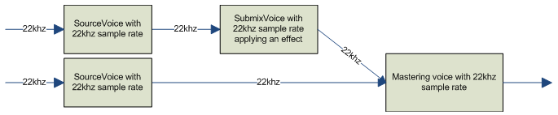
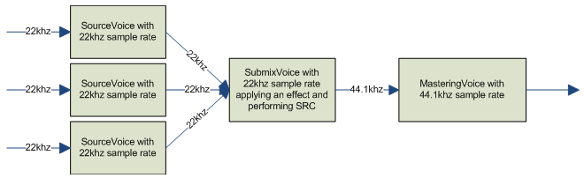
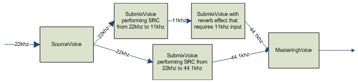

# XAudio2 Sample Rate Conversions

XAudio2 voices can perform automatic sample rate conversions if their input sample rate is different from the input sample rate of their output voices.

Sample rate conversions follow these rules:

-   Voice input sample rate is fixed.

    Voices can only handle the input sample rate specified when they were created. For [**mastering voices**](/windows/desktop/api/xaudio2/nn-xaudio2-ixaudio2masteringvoice) and [**submix voices**](/windows/desktop/api/xaudio2/nn-xaudio2-ixaudio2submixvoice), the input sample rate is specified with the *InputSampleRate* argument to the [**IXAudio2::CreateMasteringVoice**](/windows/win32/api/xaudio2/nf-xaudio2-ixaudio2-createmasteringvoice) and [**IXAudio2::CreateSubmixVoice**](/windows/win32/api/xaudio2/nf-xaudio2-ixaudio2-createsubmixvoice) functions. For source voices, the input sample rate of the voice is specified by the pSourceFormat argument to the [**IXAudio2::CreateSourceVoice**](/windows/win32/api/xaudio2/nf-xaudio2-ixaudio2-createsourcevoice) function.

-   All of a voice's output voices must have the same input sample rate.

    Voices can convert from their input sample rate to any output sample rate, but all of the voice's output voices must have the same input sample rate. For example, a voice could output to any number of voices with an input sample rate of 22 kHz. However, if that same voice had several output voices, each of which had a different input sample rate, the audio graph would not be valid.

-   Sample rate conversion processing only occurs when necessary.

    Converting audio data to a different sample rate incurs more processing overhead, which it is preferable to avoid. If a voice's input sample rate matches the input sample rate of its output voices, this conversion is not done and processing time is shortened.

-   Output sample rate can vary over the life of a voice.

    The output sample rate of a voice is not fixed. As long as all of its output voices have the same input sample rate, the audio graph will be valid. If a voice is changed to output to new voices with a different input sample rate, the voice will convert to the input sample rate of the new voices.

There are some scenarios in which it is necessary to add a submix voice to perform sample rate conversion between voices. If a voice needs to output to voices with various input sample rates, only one of the voices can be a direct output of the original voice. Because all of a voice's output voices must have the same input sample rate, the other voices receive output indirectly. There must be a submix voice with the correct input sample rate that comes between the original voice and the intended output voice.

For example, consider a source voice with an input sample rate of 22 kHz, which needs to output to a submix voice with an input sample rate of 11 kHz and a mastering voice with an input sample rate of 44.1 kHz. Because the two output voices have different input sample rates, you need to insert more submix voices between the original voice and its intended output voices. To maintain the fidelity of the source voice and avoid unnecessary expensive conversions to higher sample rates, you need to insert two submix voices with 22 khz sample input rates into the graph. One submix voice would output at 11 khz to the submix voice with the reverb effect, and the other submix voice would output to the mastering voice at 44.1 khz.

## Examples of Sample Rate Conversion in Audio Graphs

All voices have the same sample input rate; no sample rate conversion is done in the audio graph.

All voices have the same sample input rate except the mastering voice; sample rate conversion is only performed on data going to the mastering voice. 

Voices have different sample input rates and require more submix voices to perform sample rate conversions; sample rate conversion is performed in multiple places in the audio graph. 

## Related topics

<dl> <dt>

[Voices](voices.md)
</dt> <dt>

[XAudio2 Programming Guide](programming-guide.md)
</dt> </dl>

 

 
