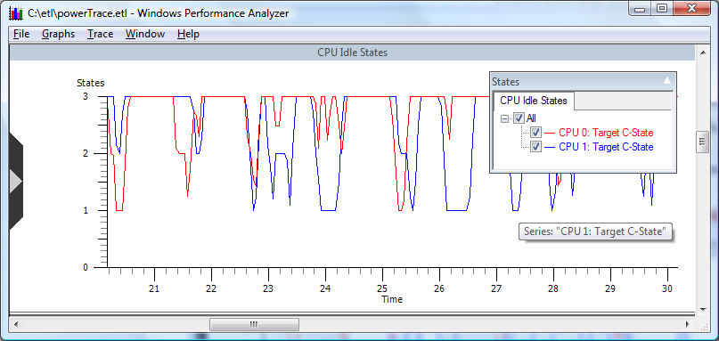

# CPU Idle States

**Overview:** Displays CPU idle states by CPU, as shown in the following screen shot.

**Graph Type:** Usage graph.

**Y-axis Units:** CPU C-states.

**Required Flags:** POWER

**Events Captured:** CPU Power events

**Legend Description:** Displays actual and target CPU states.

**Graph Description:** Displays CPU idle states, known as C-states for a defined time interval.

C-states, also known as CPU Idle states, are states when the CPU has reduced or turned off selected functions. Different processors support different numbers of C-states in which various parts of the CPU are turned off. Generally, higher C-states shut off more parts of the CPU, leading to significantly reduced power consumption.

Processor power policy is owned and managed by the Windows kernel power manager. The power manager is responsible for choosing the correct processor state known as the "Target" state. This Target state is based on CPU usage and other factors, depending on the processor power management technology involved. The "Actual" state displayed on this graph reflects the actual C-state of the CPU at a point in time.

> [!Note]There is a possibility a CPU manufacturer may choose not to expose all C-states supported by a processor. Time spent in those unexposed states may have been spent in even deeper C-states than indicated. However, since this information is not made available to Windows, information on unexposed CPU states will not be shown in WPA.
>
> For more detailed information on power management for Windows please see [Processor Power Management in Windows Vista and Windows Server 2008](http://go.microsoft.com/fwlink/p/?linkid=144216).

 

 

 

