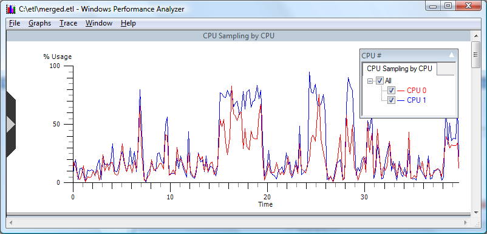

# CPU Sampling by CPU

**Overview:** This graph presents a high-level view of CPU usage aggregated by individual CPU, as shown in the following screen shot.

**Graph Type:** Usage graph

**Y-axis Units:** Percentage of CPU used

**Required Flags:** LOADER+ PROC\_THREAD+PROFILE

**Events Captured:** Kernel-mode and user-mode Image Load/Unload, Process and Thread Create/Delete, CPU Sample Profile

**Legend Description:** Shows active CPUs on the system that were active when the trace was started

**Graph Description:** Displays data sampled by WPA at millisecond intervals. Specific CPU sampling can be selected by choosing CPU data series from the legend.

> [!Note]  
> Although this graph is referred to as a "usage graph", the data displayed is calculated by sampling CPU activity as opposed to the CPU Usage graphs that calculate the usage based on context switch events. For more information on calculating usage graphs please see [Notes on WPA Sampling](notes-on-wpa-sampling.md).

 

 

 

