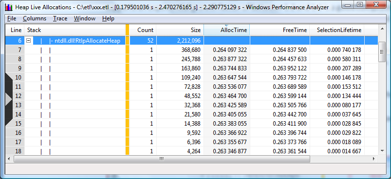

# Data Structure Sizing Recommendations

Analysis of heap usage scenarios suggest setting an initial data structure size that supports an exponential growth factor of between 1.2 and 1.6 is a good compromise between CPU costs and outstanding size. A growth factor of 1.5 is recommended unless the data indicates otherwise.

The table below, Example of a summary table view of a data structure with a good growth strategy, illustrates of a data structure with a good growth algorithm. The final size of the data structure is 368,680 bytes, but due to the growth policy the buffer was grown 52 times over 35 milliseconds with a total allocation size of 2,212,096 bytes.

 

 

