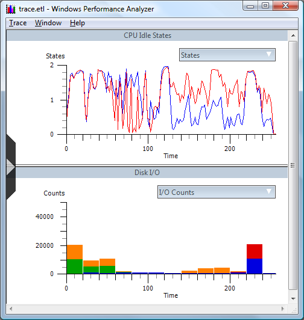
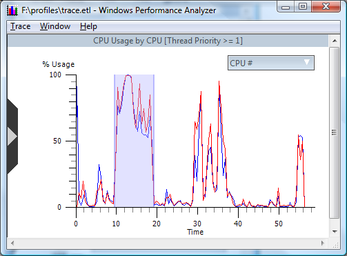
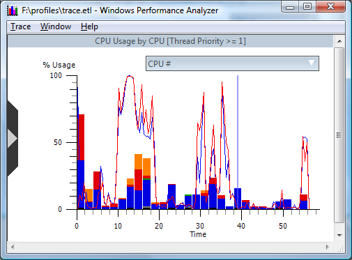
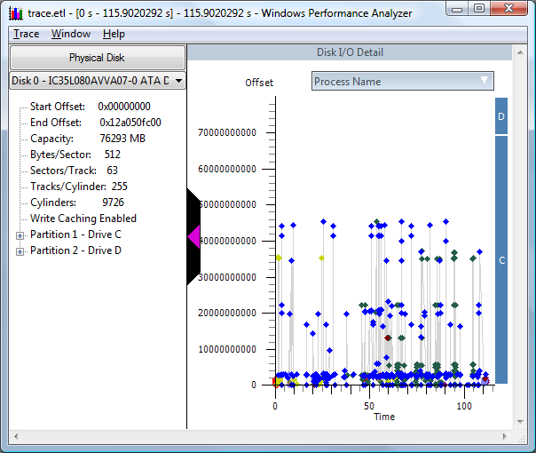
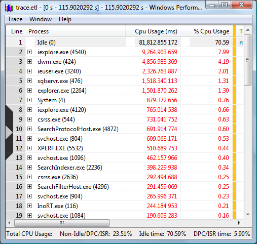
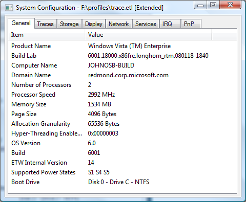

# Detailed Walkthrough

When using Windows Performance Analyzer, Xperf is primarily used for the following operations:

-   Control tracing. You start and stop tracing sessions and specify the events that should be logged.

-   Trace merging and enhancement. A kernel trace must be "merged" on the machine on which it was taken before it can be processed by the tools or viewed on another machine. The merge operation adds meta-information from the target machine to the trace. Additionally, the merge operation can combine multiple traces.

-   Trace processing. Xperf supports many dedicated analyzers, called actions. Actions produce reports about specific parts of the trace. For more information on actions please see the Actions section of this document.

More Xperf capabilities are discussed later in this document. You can also find the latest version of this document, an FAQ, examples, and guides on the [Windows Hardware and Driver Central (WHDC)](http://go.microsoft.com/fwlink/p/?linkid=103276) Web site. You can use the online forms to ask questions and discuss the tools and analysis techniques with other users.

The rest of this topic shows you some basics about how to get started with Performance Analyzer.

### Launching an elevated command prompt

In order to have access to certain kernel events xperf must be run from an elevated command prompt. To create an elevated command prompt, right-click a command prompt shortcut, and click **Run as administrator**.

> [!Note]  
> To access a command prompt shortcut in Windows Vista, click **Start**, click **All Programs**, and then click **Accessories**.

 

### Enabling kernel tracing

For many tasks, you need only a kernel trace for effective analysis. For this example, we'll use the **-on DiagEasy** parameter to enable the following kernel events: image loading, disk I/O, process and thread events, hard faults, deferred procedure calls, interrupts, context switches, and performance counters. The following command starts the kernel logger in sequential mode to the default file "\\kernel.etl" and uses a default buffer size of 64K, with a minimum of 64 and a maximum of 320 buffers:


```
xperf -on DiagEasy
```


Additonally, you can configure the trace filename by using the **-f &lt;filename&gt;** parameter.

### Performing one or more operations

Now that the kernel logger is running and generating events, you can open or run an application, or perform other operations. As an example, you can open Visual Studio, compile a program, and then close Visual Studio. You can use a command line similar to the following example:


```
c:\vs\Common7\IDE\devenv.com c:\Coding\test\test.sln /rebuild 
```


### Stopping the kernel logger

The following command stops the kernel logger, and then merges and saves the data to a file named Trace.etl.


```
xperf -d trace.etl
```


In this example, the resulting trace file was 50.7 MB in size.

### Viewing the trace with Performance Analyzer

Now that you have a trace, you can use Performance Analyzer's graphical trace views and detailed summary reports to examine it in detail.

The following command launches Performance Analyzer to view the trace:


```
xperf trace.etl
```


> [!Note]  
> The command-line tool, Xperf, is not the graphical tool. Xperf interprets this command line as a request to view the trace with Performance Analyzer. It then forwards the file name to Performance Analyzer that then opens and displays the data in the file.

 

-   You can run Performance Analyzer directly by using the Xperf view command from the command line or by running Performance Analyzer from the Start menu.

    When you open the trace, you will see something similar to the following screen shot.

    

-   On the **Selector** tab on the left side of the window, you can select the available charts. The CPU usage and disk I/O graphics show you how the CPU and disk were used throughout the trace. The X-axis of all charts represents time. The timeline is replicated and synchronized between all Performance Analyzer charts.

-   It is important to be able to zoom in and out of a figure of the trace. To magnify a section of the chart, drag the mouse to create a highlighted region, as shown in the following screen shot.

    

-   Right-click in the zoom region and click **Zoom to Selection**. The X-axis on all the charts will zoom to that region. By using the **Unzoom** command, you zoom the charts all the way so that you can view the entire trace. If your mouse has a wheel button, you can zoom in and out by pressing the Ctrl key and rolling the mouse wheel.

### Overlaying one Graph on Another

One of the most useful visualization techniques is to overlay one graph over another. Combining the CPU usage chart and the Disk I/O chart is one of the more common techniques.

-   To do this, right-click the CPU chart, click **Overlay Graph**, then **Disk I/O** and **All**. This will give you a view similar to the following screen shot.

    

-   You can then zoom in to see exactly how CPU utilization and Disk I/O access performed when they were run simultaneously.

### Using the Disk I/O Detail Graph

Performance Analyzer supports another type of chart for disk I/O called the detail graph.

-   To view this chart, right-click a region on the Disk I/O or Disk Utilization chart and click **Detail Graph**. It will display a figure that is similar to the following screen shot:

    

This demonstrates the logical offsets of each disk I/O over a period of time. By using this graph, you can see I/O patterns, including, for example, file fragmentation.

### Viewing Summary Details

Graphical views of trace data provide an excellent way to see what was happening during the trace. In essence, the graphs are rich visual summaries of the data; however, you can view more detail in the Performance Analyzer summary table views.

-   To access a summary table for a chart, select a region. From the Context Menu, click the **Summary Table** command. The following screen shot provides an example from the **CPU usage by Thread Priority** chart.

    

    In this figure, you can see that during the trace, 52.49% of the CPU time was spent in the idle process. Twelve percent was spent in Devenv.exe (Visual Studio) and 14.91% in Cl.exe in two processes (this is the compiler itself). Summary tables group the data by the values in the columns at the left of the gold bar and aggregate the following columns accordingly.

-   The groups can be expanded and collapsed by clicking the plus or minus sign on their left or by using the arrow keys on your keyboard.

-   If you click a column header of the table, you sort the data in the table by the corresponding column. The data is sorted at both the group level and at subgroup and individual levels inside groups. The column header is a toggle, so if you click it again, it reverses the sort order for that column. You can use the selector on the left sidebar to hide or show columns.

-   You can drag columns around and change groups dynamically as you need to.

-   You can copy summary table data into a spread sheet or other applications. To do this, right-click a region of data that you want to export and click **Export**. Export the data into a CSV file. You can also copy the summary table to the clipboard and paste it into the target application.

### Viewing System Information

One of the most important features of ETW and the Xperf tools is that they are designed to enable trace processing and analysis on any machine, rather than on only the machine on which the trace was taken. However, as with any analysis or debugging technique, you must have system configuration information for the machine on which the trace was taken.

### To acquire system information for the trace machine

-   On the **Trace** menu in Performance Analyzer, click **System Configuration**.

The following screen shot shows an example of a System Configuration window.



> \[!Tip\]  
> You can also use the following code to run the sysconfig action:

 


```
xperf -i trace.etl -a sysconfig
```


 

 


