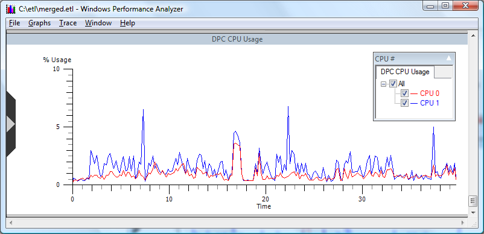

# DPC CPU Usage

**Overview:** Displays CPU resources consumed when servicing Deferred Procedure Calls, as in the following screen shot.

**Graph Type:** Usage graph

**Y-axis Units:** Percentage of CPU usage

**Required Flags:** DPC

**Events Captured:** DPC events

**Legend Description:** Displays active CPUs on the system.

**Graph Description:** This graph displays the percentage of the total CPU resource each processor spends servicing Deferred Procedure Calls. Deferred Procedure Calls (DPCs) are on a queue specific to each processor. DPCs provide the operating system with the capability to handle interrupts without blocking other hardware interrupts. For more information on this topic see *Windows Internals* by David A. Solomon and Mark E. Russinovich (4th edition, Microsoft Press, 2005).

 

 

