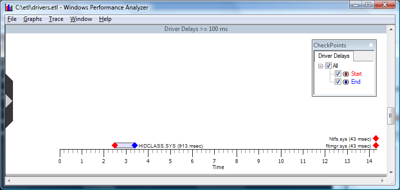

# Driver Delay

**Overview:** Displays driver delays in an event graph, as shown in the following screen shot.

**Graph Type:** Event graph.

**Y-axis Units:** Drivers

**Required Flags:** DRIVERS+ CSWITCH+PROC\_THREAD+LOADER

**Events Captured:** Driver delays greater than or equal to 100 milliseconds

**Legend Description:** Displays start and stop times for callbacks into a driver.

**Graph Description:** Displays how long drivers took to process Input/Output Controls, which are also referred to as ioctls. Delays in loading drivers can have a significant effect on system and application performance.

This graph allows the user to set a minimum driver delay by right clicking to open the context menu and selecting **Set Delay Threshold**. The following box appears, as shown in the following screen shot.

 

 

