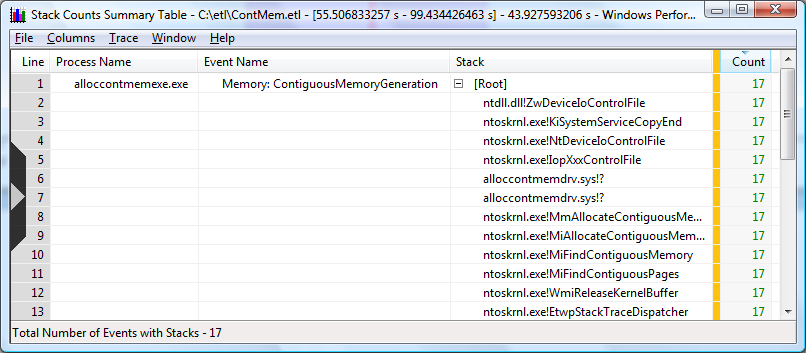

# Evaluating Contiguous Memory Allocation Data

Please see the section [Collecting Contiguous Memory Allocation Data](collecting-contiguous-memory-allocation-data.md) for an explanation of this scenario.

### Viewing Contiguous Allocation Data in a Summary Table

1.  To begin analysis of the trace file, enter the following at the command line:

    ```
    xperf ContMem.etl
    ```

    

    This will bring up the graph viewing facility. Choose the **Stack Counts by Type** graph from the list of graphs. For more information on using the graph facility of WPT please see [Windows Performance Analyzer Feature: Graphs](windows-performance-analyzer-feature--graphs.md).

2.  Open the Context Menu by right clicking on the graph and choosing **Summary Table** from the context menu. For more information on using summary tables please see the [Summary Tables](summary-tables.md) section of this document. A summary table similar to the following screen shot will open.

    

    This summary table indicates the process alloccontmemexe.exe generated 17 contiguous memory events. Additionally, the calling stack for each of the allocations is listed.

### Viewing Contiguous Memory Allocation Data in Text Format

For information on viewing trace data in text format, please see the [Actions](actions.md) section of this document.

1.  From the command line enter the following:

    ```
    xperf -i ContMem.etl -o ContMem.txt
    ```

    

    This command will parse the trace file, ContMem.etl, and reformat the data in ASCII format.

2.  Open ContMem.txt using your text editor.

3.  Search for "ContiguousMemoryGeneration" in ContMem.txt

The following is an example of a driver allocating 64 MB of memory. This is denoted by the number 67108864.

ContiguousMemoryGeneration, 56768383, alloccontmemexe.exe (1784), 324, 0, <span class="underline">67108864</span>

Stack, 56768383, 324, 1, 0xfffff80001104787, ntoskrnl.exe!EtwpStackTraceDispatcher

Stack, 56768383, 324, 2, 0xfffff800013eaf90, ntoskrnl.exe!WmiReleaseKernelBuffer

Stack, 56768383, 324, 3, 0xfffff800010b800c, ntoskrnl.exe!MiFindContiguousPages

Stack, 56768383, 324, 4, 0xfffff8000128de86, ntoskrnl.exe!MiFindContiguousMemory

Stack, 56768383, 324, 5, 0xfffff8000101cb2d, ntoskrnl.exe!MiAllocateContiguousMemory

Stack, 56768383, 324, 6, 0xfffff8000102d15d, ntoskrnl.exe!MmAllocateContiguousMemorySpecifyCache

Stack, 56768383, 324, 7, 0xfffffadfe7827260, alloccontmemdrv.sys!0xfffffadfe7827260

Stack, 56768383, 324, 8, 0xfffffadfe7827334, alloccontmemdrv.sys!0xfffffadfe7827334

Stack, 56768383, 324, 9, 0xfffff800012d28cf, ntoskrnl.exe!IopXxxControlFile

Stack, 56768383, 324, 10, 0xfffff800012e2f26, ntoskrnl.exe!NtDeviceIoControlFile

Stack, 56768383, 324, 11, 0xfffff80001040bfd, ntoskrnl.exe!KiSystemServiceCopyEnd

Stack, 56768383, 324, 12, 0x0000000077ef0a5a, ntdll.dll!ZwDeviceIoControlFile

 

 


