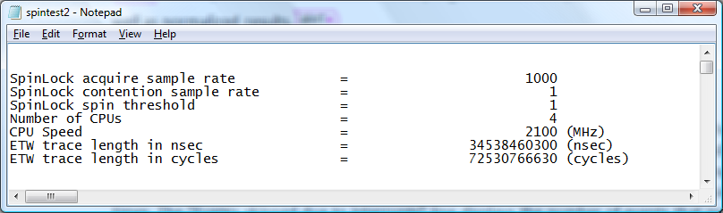

# Evaluating Spin Lock Data

### Processing Spin Lock Event Data

Spin Lock event data is interpreted using the Windows Performance Toolkit action "spinlock". For information on using actions please see the [Actions](actions.md) section of this document. Once event data has been collected into an "etl" file, as described in the [Collecting Spin Lock Data](collecting-spin-lock-data.md) section of this document, process the etl file using this syntax:


```
xperf -i example.etl -symbols -o example.txt -a spinlock
```


| Command, Parameter or Option | Usage                                                                                                                                                                                                 |
|------------------------------|-------------------------------------------------------------------------------------------------------------------------------------------------------------------------------------------------------|
| xperf<br/>             | Invokes Windows Performance Toolkit processing.<br/>                                                                                                                                            |
| -i example.etl<br/>    | Use the example.etl file for input <br/>                                                                                                                                                        |
| -symbols<br/>          | Apply symbol information to the output file. For more information on configuring your system to use symbols, please see the [Symbol Support](symbol-support.md) section of this document.<br/> |
| -o example.txt<br/>    | Output the results of this processing to the file example.txt.<br/>                                                                                                                             |
| -a spinlock<br/>       | Collate Spin Lock event information employing the "spinlock" Action.<br/>                                                                                                                       |


 

For help with spinlock action processing, please use the following command line syntax:


```
xperf  -help spinlock
```


### Understanding Spin Lock Report Data

The following screen shot displays the summary section of a Spin Lock report.



The graphic Summary Section of a sample Spin Lock report displays the first section of the report showing environment, parameter and timing information that is used to calculate individual Spin Lock information.

The next sections of the report show the Spin Lock usage during the profile time period. The usage of each Spin Lock is shown separately. Spin Locks are sorted with the "hottest" Spin Locks shown first. Often it is possible to identify the spinlock bottleneck just by looking into the top few Spin Locks.

The following screen shot shows a report displaying individual Spin Lock information.


Individual Spin Lock Information:

1.  Type of lock.

2.  Kernel address of lock.

3.  Symbol of the lock.

    > [!Note]  
    > Spinlocks created dynamically will not have symbols.

     

4.  Summary Report displays the following information:

    -   Percentage of CPU time spent on lock acquisition

    -   Percentage of CPU time spent on lock contention

    -   Lock acquisition rate

    -   Collision rate

    -   Spin rate

    -   Contention rate

    > [!Note]  
    > Spinlock instrumentation is sampling based. The output will show both sampled results as well as normalized results.

     

5.  Events skipped due to interrupts - Interrupts can be fired while Spin Locks are held. In the case that an interrupt is fired while a Spin Lock is held, the interrupt handling time is included in the Spin Lock holding time. This situation can cause the Spin Lock hold time to appear inordinately long. WPT does not include Spin Lock events that are held while an interrupt is handled when calculating Spin Lock hold times. The "Events skipped due to interrupts" line displays the number of events that were not included in the calculation. This number is normally very small.

6.  Release Function - A Spin Lock can be acquired or released from different code paths. A list of release functions of the Spin Lock is displayed at the end of the Summary section. The list is sorted by the Spin Lock holding time. By scrolling to the right of the report or using the Word Wrap function of your text editor, additional Spin Lock usage, such as acquisition or contention, on a particular Release Function can be viewed.

### Summarizing Spin Lock Event Data

In order to quickly view Spin Lock event data in a summary format, WPT offers a "summary" option to the spinlock Action. For example:


```
xperf -i example.etl -symbols -o example.txt -a spinlock -summary 
```


Alternatively, the "counts" option can be used with the "summary" option to limit the number of records returned to the most active Spin Locks. For example:


```
xperf -i example.etl -symbols -o example.txt -a spinlock -summary -counts 5
```


| Command, Parameter or Option | Usage                                                                                                                                                                                                 |
|------------------------------|-------------------------------------------------------------------------------------------------------------------------------------------------------------------------------------------------------|
| xperf<br/>             | Invokes Windows Performance Toolkit processing.<br/>                                                                                                                                            |
| -i example.etl<br/>    | Use the example.etl file for input <br/>                                                                                                                                                        |
| -symbols<br/>          | Apply symbol information to the output file. For more information on configuring your system to use symbols, please see the [Symbol Support](symbol-support.md) section of this document.<br/> |
| -o example.txt<br/>    | Output the results of this processing to the file example.txt.<br/>                                                                                                                             |
| -a spinlock<br/>       | Collate Spin Lock event information employing the "spinlock" Action.<br/>                                                                                                                       |
| -summary<br/>          | Summarize the Spin Lock event information into a tab delimited format.<br/>                                                                                                                     |
| -counts \[n\]<br/>     | Display only the most active \[n\] Spin Lock events.<br/>                                                                                                                                       |


 

Using the "summary" option with the spinlock Action allows you to easily import data into Microsoft Excel or other tools for analysis, as shown in the following screen shot.


 

 


