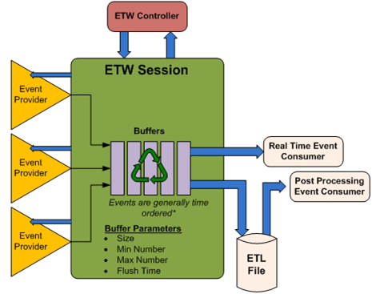

# Event Tracing for Windows

The Event Tracing for Windows (ETW) infrastructure provides the foundation for Windows Performance Analyzer (WPA). WPA provides a set of programs that hide the complexity of working directly with the ETW application programming interfaces.

The following information is a high level introduction to ETW. For more information on Event Tracing for Windows see [MSDN](http://go.microsoft.com/fwlink/p/?linkid=141498).

ETW enables the capture of kernel and application events in a consistent, straightforward manner. Event capture can be enabled and disabled at any time without requiring system or process restarts. WPA presents the information collected by ETW in an easy to understand set of graphs, tables and data summaries.

By capturing and presenting selected events, you can identify and diagnose system and application performance issues in a non-invasive manner. ETW lets you enable or disable event tracing dynamically. Windows Performance Analyzer uses ETW to gather and organize critical system information.

The ETW architecture is broken into three distinct components:

-   Controllers - Start and stop an event tracing session and enable providers

-   Providers - Return specified events

-   Consumers - Analyze the data returned by providers

The following diagram shows event tracing for Windows architecture.

WPA uses a trace capture and analysis model that follows this general flow:

1.  Tracing is enabled using WPA command-line syntax (Controller)

2.  Event data is gathered from the named providers (Provider)

3.  ETW collection is stopped and the data is saved to an ETL trace file using WPA (Controller)

4.  Trace files can be viewed using WPA. Multiple trace files can be merged and viewed using WPA (Consumer)

Kernel and application events can provide extensive details about the operation of the system. Virtually every kernel event that impacts overall system performance has been defined and made available to WPA through a selective aggregator, NT Kernel Logger. In order to simplify aggregation of events, WPA provides pre-defined sets of events which can be combined as necessary.

Additionally, application developers can provide events to WPA by using the Windows Event API. For more information about including event publishing in your application, see [MSDN](http://go.microsoft.com/fwlink/p/?linkid=141515).

 

 

