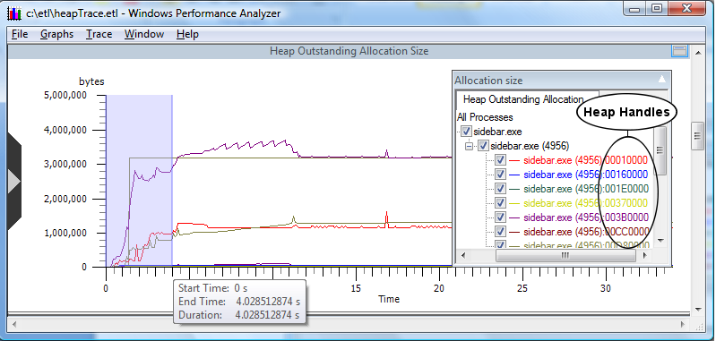

# Graphing a Specific Time Interval

Left click and drag across the vertical time scale as displayed in **Time interval selected**. When satisfied with the time interval selection, release the mouse button. Right click and select **zoom** from the context menu. The graph will expand and show only the time interval selected, as in the following screen shot.

The following screen shot displays a graph showing the heap outstanding allocation size zoomed to the selected time interval.

For more information on formatting graphs please see the [Graphs](windows-performance-analyzer-feature--graphs.md) section of this document.

 

 

