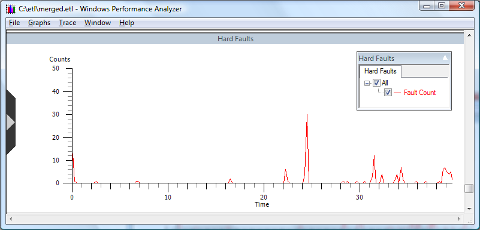

# Hard Faults

**Overview:** Counts hard page faults over a time interval, as shown in the following screen shot.

**Graph Type:** Event graph

**Y-axis Units:** Count of system hard faults

**Required Flags:** HARD\_FAULTS

**Events Captured:** Hard fault events

**Legend Description:** Shows hard fault count

**Graph Description:** Hard faults occur when the operating system retrieves memory pages from disk rather than from the in-memory pages that the memory manager maintains.

For more information on this topic see **Windows Internals** by David A. Solomon and Mark E. Russinovich (4th edition, Microsoft Press, 2005).

 

 

