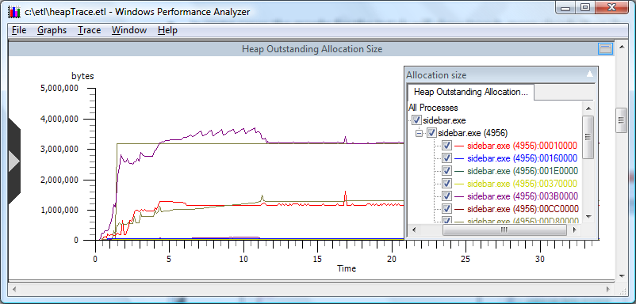

# Heap Outstanding Allocation Size

The following screen shot displays a graph showing the heap outstanding allocation size.

-   The steepness of the line slopes are indications of an increase in the size of allocations.

-   Allocations that have short lifetimes are displayed by ripples on the graph plots.

 

 

