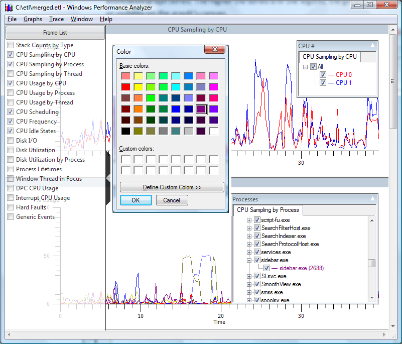

# Identifying and Selecting Data Series with the Legend

Often a large number of data series are presented in a graph. In order to limit the number of data series presented on the graph, click the legend bar, located on the right side of the graph. Selecting an item checkbox from the legend displays the corresponding series on the graph. The **All** checkbox toggles all items on and all items off.

Placing the cursor over a graph line opens a tooltip that identifies the data series represented by the graph line. Selections on the legend menu are color coded to match the graph colors. Double clicking a data series presents a color selection dialog that allows the user to choose custom colors for that data series and legend.

Dragging a series up and down the legend menu changes the Z-ordering of the associated graph series. The higher the series is in the legend, the greater its z-order or visibility on the graph's canvas.

The following screen shot shows CPU Sampling by CPU, and CPU Sampling by Process.

**CPU Sampling by CPU and CPU Sampling by Process** displays the first two graphs in the series. Both legends are open to select CPU and Process data series to be displayed. Additionally, the color selection menu has been opened.

 

 

