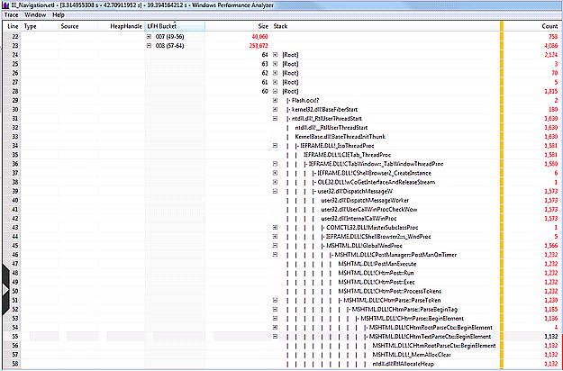

# LFH Bucket Usage

The Low Fragmentation Heap (LFH) allocates storage space in predefined buckets to reduce the potential for heap fragmentation from repetitive alloc/free activity over the lifetime of a process. As a result of the granularity of the fixed size buckets there can sometimes be opportunities for decreasing outstanding heap footprint from minor reductions in the size of an allocation that cause it to move the next smaller bucket. These opportunities can be made apparent by sorting the data using the LFH Bucket column in conjunction with the size and stack columns as shown in the next figure. For the larger bucket sizes the potential for reductions can be much more substantial than the actual reduction in size of the data structure would otherwise indicate.

The following screen shot displays opportunities for reduction in outstanding allocations by LFH bucket usage.

 

 

