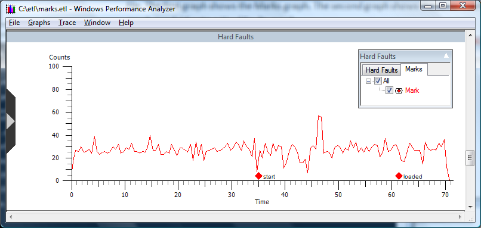

# Marks

**Overview:** The Marks functionality enables a user to annotate an event graph using custom check points. In the following screen shot, marks have been inserted into the trace file.


The following screen shot shows the graphs overlaid



**Graph Type:** Event graph

**Y-axis Units:** User-defined check points

**Required Flags:** No flags, uses the **-m** option, see the following Note.

**Events Captured:** A point in time

**Legend Description:** None

**Graph Description:** Displays user-defined check points within a trace.

Marks functionality is used to produce user annotated graphs by overlaying a user defined Marks graph on to other graphs from the same trace. This example graph was produced by the following set of commands:


```
C:\etl> xperf -on Base
C:\etl> xperf - m "start"
C:\etl> \Program Files\Windows Sidebar\sidebar.exe
C:\etl> xperf -m "loaded"
C:\etl> xperf -d marks.etl
```


In this example, upon opening the marks.etl trace file, the Marks graph was overlaid on to the Hard Faults graph allowing the analyst to understand hard fault activity that may have resulted from loading sidebar.exe.

 

 


