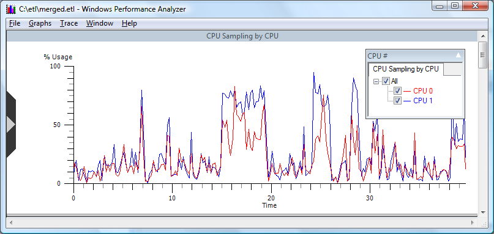

# Opening Graphs

To view a set of graphs, from the command line enter:


```
xperf merged.etl
```


Where merged.etl is the trace file to be analyzed.

The following screen shot displays the first graph presented when employing the default graph selections:



 

 


