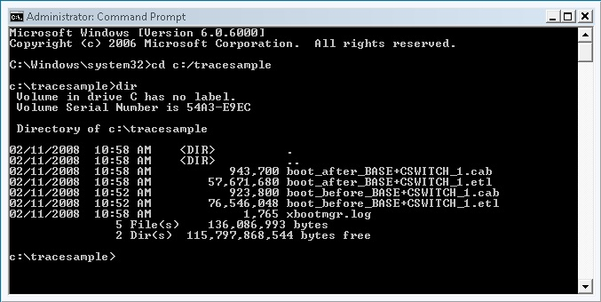

# Other Useful Features

You can use the `-runtag` option to insert a short text string into the names of the generated trace files. This can be useful when taking before-and-after runs around configuration changes, for example:


```
xbootmgr -trace boot -runtag before
```


Next, the system configuration is modified, and the trace repeated:


```
xbootmgr -trace boot -runtag after
```


The two traces are clearly identified, as shown in the following screen shot:



 

 


