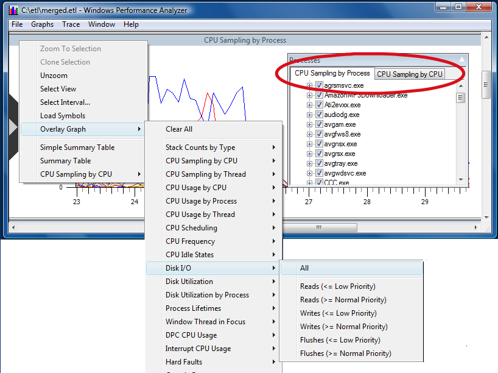
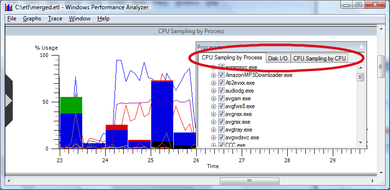

# Overlaying Graphs

Often viewing multiple graphs in a single frame can help the analyst understand performance implications across many metrics. To overlay graphs, right click to display the context menu and select **Overlay Graphs**. A list of the graphs is opened. Selecting a frame will open a selection list containing all the data series shown on the graph.

The following screen shot illustrates that the sidebar.exe process is using significantly more CPU compared to other running processes. Note the consistent color coding.

To understand the ramifications of the sidebar.exe process on system performance by overlaying graphs, take the following steps:

1.  With the **CPU Sampling by Process** graph open, right click to open the context menu.

2.  Point to **Overlay Graph** from the context menu.

3.  Point to **CPU Usage by CPU**.

4.  Point to **All** and left click.

The **CPU Usage by CPU** graph will now be displayed in the same frame as the **CPU Sampling by Process** graph. Repeat these steps pointing to **Disk I/O** for **CPU Usage by CPU** in step 3. Selecting an overlay graph illustrates the menus encountered when following this procedure.

After performing these steps, two graphs, **Disk I/O** and **CPU Sampling by CPU** are overlaid on the **CPU Sampling by Process** graph as illustrated in the following screen shot.

After performing these steps, two graphs, **Disk I/O** and **CPU Sampling by CPU**, are overlaid on the **CPU Sampling by Process** graph as illustrated in **CPU Usage by Process overlaid with Disk I/O and CPU Sampling by CPU**.

After graphs are overlaid, selecting the **Processes** legend displays not only **CPU Sampling by Process** data series but also tabs that open the legends for the two overlaid graphs. Toggling the **All** selection selects all or none of the selections. In this the following screen shot, the sidebar.exe process is selected along with all the data from the two overlaid graphs.

Separating the legends for each graph by tab allows you to easily mix and match metrics and data points from different graphs on a common time scale. The front to back ordering, also referred to as the "z ordering", of the graphs is controlled by dragging and dropping the respective legend tabs. The leftmost data tab displays the corresponding graph in front. The next tab to the right will display behind the first graph, etc.

Data series on the legend are color coded to match the series graph colors. Double clicking an item will launch a color selection dialog that allows the user to redefine the associated colors.

 

 

