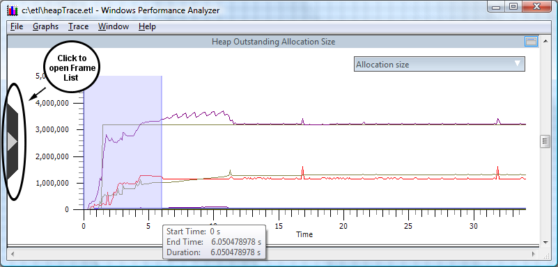

# Quick Start - Viewing Heap Data Using Graphs

WPA loads multiple graphs based on the options and flags selected. These graphs show overall trends in heap allocations. To view the heap information, follow these steps:

1.  Enter the following in the command window:

    ```
    C:\etl> Xperfview heapTrace.etl
    ```

    

2.  Open the Frame List, located on the left side of the graph, by clicking the chevron.

3.  Ensure all of the heap selections are checked.

4.  Close the Frame List by clicking the chevron again.

5.  Scroll to the **Heap Outstanding Allocation Size** chart.

6.  Place the cursor on the time line.

7.  Select the time interval, in this case 0 to 6 seconds, by left clicking and dragging from 1 to 6 on the time line. The selection will be highlighted.

8.  Right click on any white space in the chart to open the context menu and select **Zoom to Selection**.

The time interval selected will be applied to all of the charts. This feature provides a consistent view of the time interval being examined across all the graphs, as shown in the following screen shot.



The following screen show shows the Allocation Size graph zoomed.


For more complete information on using graphs to analyze heap data, please see the [Analyzing Process Heap Data](analyzing-process-heap-data.md) section of this document.

 

 


