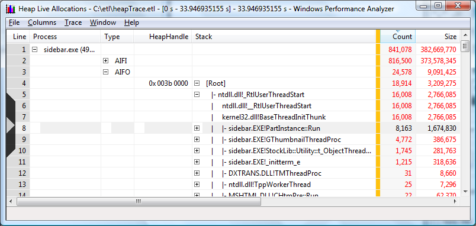

# Quick Start - Viewing Heap Data Using Summary Tables

Summary tables are used to explore detailed allocation history and understand the processes and individual threads responsible for the heap activity. To take full advantage of this section of this exercise, be sure the \_NT\_SYMBOL\_PATH environment variable has been set as per the installation instructions.

Summary tables are opened from a graph view. The data presented in the summary tables uses the same time interval that was defined for the graph view.

To open the summary table take the following steps:

-   Right click in the white area of any heap allocation graph and select **Load Symbols** from the context menu.

-   Right click in the white area again and select **Summary Table** from the context menu.

The first time the summary table is presented the table may not have all of the useful columns displayed. The flyout configuration panel can be used to add or remove columns from the summary table. It is displayed by clicking on the chevron on the left edge of the table. The screen shot below shows the recommended default selections for columns.

> [!Note]  
> The heap summary table contains a large amount of data. Because some tables are very wide, a large screen monitor is recommended for analysis. This is especially true if deep call stacks are present in the scenario under investigation.

 

The following points will help the new user understand working with summary tables at a high level. For a complete description of working with summary tables please see the [Summary Tables](summary-tables.md) portion of this document.

There are many combinations of column positions and data aggregation possible with summary tables. The arrangement of the columns can be used to highlight interesting aspects of the data. For example:

-   The columns in a summary table can be reordered by the dragging and dropping columns across the table.

-   Column data may be sorted in ascending or descending order by clicking the column title.

-   The sorting order of data contained within the columns is left to right, with subsequent columns sorted within the ranges determined by the preceding columns.

-   Data in columns to the left of the gold bar are aggregated.

This example uses the column arrangements the performance analysis team has found to be useful, but other configurations should be experimented with to determine which configurations are most effective for the scenario being investigated.

Next, open call stacks.

-   Click on the outermost call to be investigated.

-   Click and drag the **Type** column to the far left of the graph.

-   Click and drag the **Heap Handle** column to the right of the Type column.

-   Click the column heading for **Type** to perform an ascending sort by type of allocation.

The chart should look like the following screen shot.

The Type column indicates the lifetime of the allocations relative to the selected time interval. Every individual allocation is represented by one of the 4 possible Type values:

-   AIFI = Allocated Inside Freed Inside

-   AIFO = Allocated Inside Freed Outside

-   AOFI = Allocated Outside Freed Inside

-   AOFO = Allocated Outside Freed Outside

The usual assumption when analyzing heaps is that AIFI allocations are transient,and AIFO are outstanding.

To drill down on the open call stacks:

-   Click on the outermost call to be investigated.

-   Open the inner stack frames by pressing and holding the right arrow key down until there are no more plus signs in the stack. The mouse can also be used to open stack frames by clicking on the plus signs.

-   Press and hold the left arrow key to collapse call stacks.

The following screen shot shows a summary table sorted by process, type, and heap handle.

Notes on **Summary table sorted by process, type and heap handle**:

-   The data is sorted by process. In this case sidebar.exe has been opened.

-   Allocations made inside the process and freed outside the process are opened for examination.

-   The first two functions associated with heap handle 0x003b 0000 are open.

-   The first execution of sidebar.exe code, where allocations were made within the process but not freed, made 777 heap allocations that allocated 146,714 bytes.

-   Expanding the window and using the scroll bars will display more information.

The user can apply the steps and techniques described here to explore additional time intervals, data selections and data collations. For more complete information on using WPA to perform process heap analysis, please see the next section of this document, [Using Windows Performance Analyzer to Analyze Process Heaps](analyzing-process-heap-data.md).

 

 

