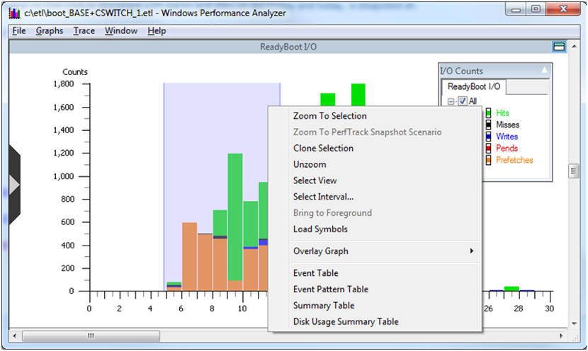
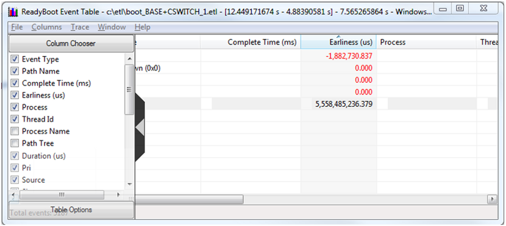
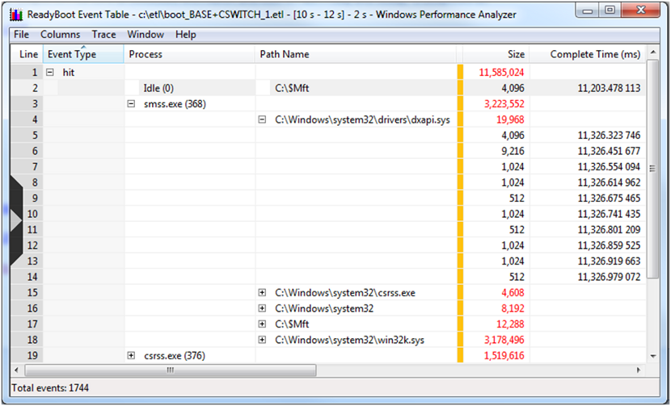

# Quick Start: ReadyBoot Summary Tables

Summary tables are used to explore detailed ReadyBoot information and understand access patterns of boot I/O activity.

The data presented in the summary tables uses the same time interval that was defined for a graph view in the [Quick Start: ReadyBoot Graphs](quick-start--readyboot-graphs.md) section of this document.

There are four types of summary tables for the ReadyBoot I/O graph.

-   Event Table

-   Event Pattern Table

-   Summary Table

-   Disk Usage Summary Table

> [!Note]  
> In this Quick Start section only a single summary table, the **Event Summary Table**, is covered. For information on the other summary tables please see the [ReadyBoot: Summary Tables](readyboot--summary-tables.md) section of this document.

 

### Event Table Example

<dl> <dt>

Right click the selected area of ReadyBoot I/O graph and choose Event Table from the context menu, as shown in the following screen shot.
</dt> <dt>

</dt> </dl>

The ReadyBoot summary tables can be used to analyze ReadyBoot events including cache hits and misses.

The first time a summary table is presented it will have a default set of columns displayed which does not include all columns. The flyout configuration panel can be used to add or remove columns from the summary table. It is displayed by clicking on the chevron on the left edge of the table. The screen shot below shows the recommended settings for columns. Depending on the scenario, other column configurations may be more helpful when performing analysis.

> [!Note]  
> Some ReadyBoot summary tables contain a large amount of data. Because these tables are very wide, a large screen monitor is recommended for analysis.

 

The following points will help the new user understand working with summary tables at a high level. For a complete description of working with summary tables please see the [Summary Tables](summary-tables.md) section of this document.

There are many combinations of column positions and data aggregation possible with summary tables. The arrangement of the columns can be used to highlight interesting aspects of the data. For example:

-   The columns in a summary table can be reordered by dragging and dropping columns across the table.

-   Column data may be sorted in ascending or descending order by clicking the column title.

-   The sorting order of data contained within the columns is left to right, with subsequent columns sorted within the ranges determined by the preceding columns.

-   Data in columns to the left of the gold bar are aggregated.

<dl> <dt>

Event Table lets you look at the ReadyBoot cache activity during a specified interval at the level of individual I/Os. Remember that the Disk I/O graphs and summary tables do not reflect read requests that were satisfied from the ReadyBoot cache. This table provides the means to look at these requests in a way similar to Disk I/O summary tables.
</dt> <dt>

For example, to look at which processes issued read requests that resulted in ReadyBoot cache hits in the time interval between 10 and 12 seconds into boot and files that were being accessed during the 10 to12 second period, perform the following steps:
</dt> </dl>

1.  On the underlying ReadyBoot I/O graph, select the interval from 10 to 12 seconds.

2.  Right click on the selection and choose "Event Table" from the context menu.

3.  When a summary table is opened, make sure that columns labeled "Event Type", "Process", "Path Name" are showing. If these columns are not displayed, use the flyout on the left to display them.

4.  Rearrange the columns by dragging the column header to have them in the following order, starting from the very left: "Event Type", "Process", "Path Name".

5.  Make sure that the gold bar is to the right of "Path Name".

6.  Expanding the process of interest (e.g. smss.exe) we see that it read 19K of dxapi.sys in 10 I/Os, which were satisfied directly from the ReadyBoot RAM cache and did not go to disk.

The following screen shot shows a ReadyBoot Event able displaying a ReadyBoot events summary for a selected time interval.

UI usage notes on the previous graph:

-   The data is sorted by event type. In this case hit type has been expanded. Clicking on the column header allows resorting by that column values when permitted by current aggregation.

-   Expanding the window and using the scroll bars will display more information.

The user can apply the steps and techniques described here to explore additional time intervals, data selections and data collations. For more information on summary tables, please see the [Summary Tables](summary-tables.md) section of the WPA documentation.

 

 

