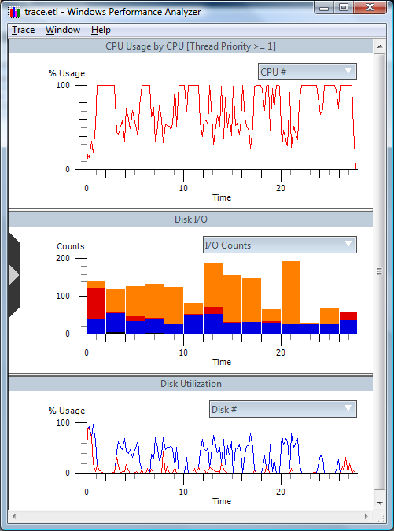

# Quick Start

The Windows Performance Analyzer tools are designed to measure and analyze Windows system and application performance. The Performance Analyzer tools consist of two primary programs, *Xperf.exe* and Performance Analyzer (*Xperfview.exe*). Xperf is a command-line tool that is used to control tracing and to process trace data. Performance Analyzer is a graphical trace data visualization tool. The WPA tools are available via the command-line tool, Xperf. After you install the tools, you can view your first trace.

### Install Windows Performance Analyzer Tools

1.  Install the tools from the appropriate MSI file for the target system's processor architecture x86 (32-bit), x64, or Itanium-based. You can use the default installation path or select another path, for example, C:\\xperf. The installer will add the Performance Analyzer installation path to your system's PATH environment variable. For more information on installation issues, please see the [Installation](installation.md) section of this document.

2.  Open an elevated command prompt window.

    1.  Click the **Start** button

    2.  Click the right mouse button

    3.  Select **Command Prompt**

    4.  Select **Run as administrator**

3.  In the command prompt window, type the following command to turn on the Windows kernel event provider and send data to the default file \\kernel.etl:

    ```
    xperf -on DiagEasy
    ```

    

4.  Compile a program or browse some Web pages.

5.  Use the following command to stop the kernel logger, and then merge and save the trace data to *Trace.etl*:

    ```
    xperf -d trace.etl  
    ```

    

6.  View the trace file in Performance Analyzer by using this command:

    ```
    xperf trace.etl  
    ```

    

A graph of the data in the trace file appears. It should look similar to the following screen shot.



This view captures processor and disk utilization, process life times, and interrupt and deferred procedure call CPU usage.

You can select regions in the graph, zoom to them, and view summary table information on the regions. You click and drag to select a region, and then right-click to display the menu for the region.

For more information and examples see the [Detailed Walkthrough](detailed-walkthrough.md) section of this document.

 

 


