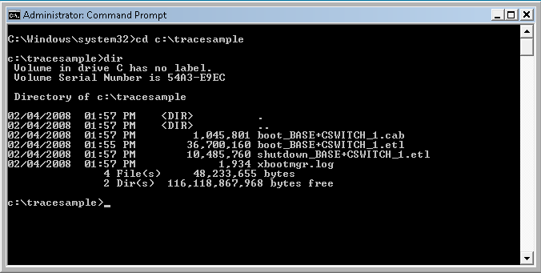
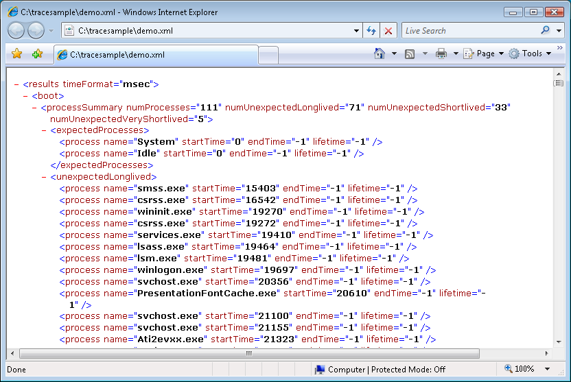
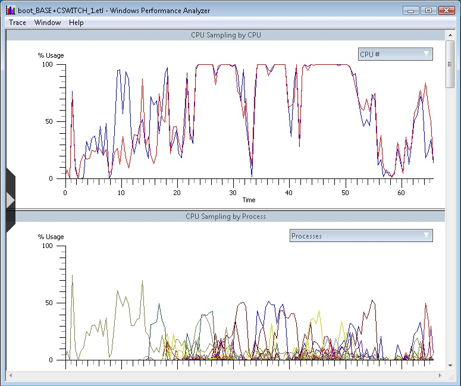

# Quick Start

You can use the following procedures to create and display trace data from a Windows Vista system during both shutdown and reboot.

To create an example trace

1.  Open an elevated command window by clicking **Start** &gt; **All Programs** &gt; **Accessories**, right-click **Command Prompt**, and select **Run as administrator**.

2.  Create a new directory and move to it by typing the following:

    ```
    mkdir c:\tracesample
    ```

    

    ```
    cd c:\tracesample
    ```

    

3.  To initiate the trace and trigger the reboot, type the following:

    ```
    xbootmgr -trace rebootCycle -noPrepReboot
    ```

    

    > [!Note]  
    > Be aware that the On/Off Transition Trace Capture tool automates state transitions. After the test computer issues a trace command, it resets within five seconds.

     

4.  A dialog box warning appears, which indicates that the trace is starting, and the computer reboots. The computer logs off, shuts down, and restarts.

5.  After you have logged on, a dialog box appears that counts down a two-minute delay. If you have logged on as a non-Administrator, a **Please allow the tool to elevate** dialog box appears. Locate the flashing **xbootmgr.exe** item on the taskbar, and click **Continue** on the dialog box to allow the boot to proceed.

    A status dialog appears and displays information about how to save and merge data. After the dialog box closes, the trace process is complete.

    > [!Note]  
    > If the status dialog box has disappeared and the trace file directory only contains \*premerge.etl files, the tool might still be in the process of merging the resulting traces. Allow a little extra time for the merge process to complete.

     

To view an example trace

1.  Open an elevated Command Prompt window by clicking **Start** &gt; **All Programs** &gt; **Accessories**, right-click **Command Prompt** and select **Run as administrator**.

2.  Navigate to the directory that was created to store the trace data by typing the following:

    ```
    cd c:\tracesample
    ```

    

3.  If you list the contents of the directory, you will see two trace files (files ending in .etl)

    

4.  To use the On/Off Transition Trace Capture tool to examine the trace file, type the following:

    ```
    xperf -i boot_BASE+CSWITCH_1.etl -a boot
    ```

    

5.  To store the output to a file such as demo.xml, type the following:

    ```
    xperf -i boot_BASE+CSWITCH_1.etl -o demo.xml -a boot
    ```

    

6.  If you type demo.xml at the command prompt, Windows Internet Explorer starts and displays the file. To view the file properly, you might need to select **Allow Blocked Content**.

    

7.  You can also use Xperfview to view the trace graphically by typing the following:

    ```
    xperfview boot_BASE+CSWITCH_1.etl
    ```

    

    The following trace appears:

    

 

 


