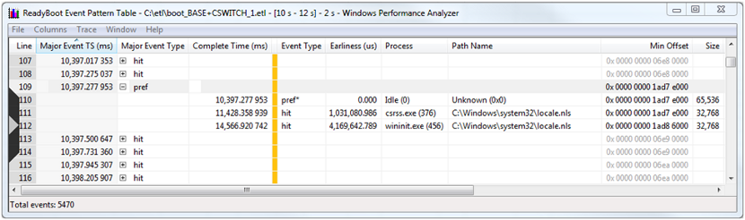

# ReadyBoot Event Pattern Summary Table

The Event Pattern Table is useful for more advanced analysis of ReadyBoot events. For generic notes on table opening, column sorting, and reordering, etc, please see the [Quick Start: ReadyBoot Summary Tables](quick-start--readyboot-summary-tables.md) section of this document or refer to [Summary Tables](summary-tables.md).

For this example, we are going to look at an access pattern for a particular block of data.

1.  On the underlying ReadyBoot I/O graph, select the interval from 10 to 12 seconds. If the interval is already highlighted there is no need to select it again.

2.  Right click on the selection and choose "Event Pattern Table" from the context menu.

3.  Make sure that column labeled "Major Event TS (ms)" is the leftmost column.

4.  Make sure "Major Event Type" and "Complete Time (ms)" columns are visible and are located to the left of the gold bar.

5.  Make sure the events are sorted by "Major Event TS (ms)". To sort, click the column header.

6.  Scroll down to the timestamp 10,397.277ms and expand the "Major Event Type" column. In this case, we see the value of "prefetch" by clicking a "+" icon or using the right arrow.

The following screen shot shows a ReadyBoot Event Pattern table displaying event patterns.

When the entry expands, three related events can be seen. These are the events that correspond to accesses to a specific block of data referenced by the major event. We can see that this particular block was prefetched into the ReadyBoot cache at 10,397.277ms as part of a 64K prefetch read request, and then was accessed by two 32K read requests by csrss.exe at 11,428.358ms and by wininit.exe at 14,566.920ms. The "prefetch" event, marked with an asterisk "pref\*", corresponds to the major event currently being examined (selected and expanded in the left two columns).

Similarly, expanding any other event type in the "Major Event TS (ms)" column would show all events that correspond to accesses to a block of data referenced by the major event.

 

 

