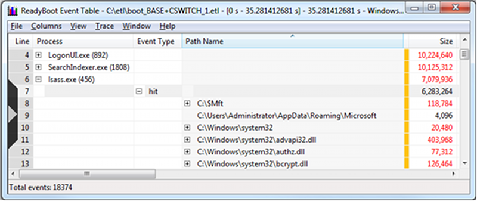

# ReadyBoot Examples

### Example 1: Understanding Your Application's Boot Read Footprint

This example demonstrates how to determine how much disk IO a given application is doing during boot and what files it is accessing. Recall that Disk IO graph and Summary Tables do not reflect the read requests which hit the ReadyBoot RAM cache. ReadyBoot Events Table provides the necessary IO information.

-   Select the interval of interest on the ReadyBoot I/O graph. This can be an interval the application in question was running or the entire boot interval.

-   Right-click and open the Event Table

-   Rearrange the column in the summary table (by dragging the column headers) to have "Process" on the very left, followed by the "Event Type", followed by "Path Name".

    The following screen shot shows a ReadyBoot Event table displaying lsass.exe ReadyBoot activity.

    

-   Expanding the process of interest, in this example lsass.exe, observe the kinds of IO that process has been doing during the selected interval.

-   Note that some of the reads from lsass.exe hit in the ReadyBoot cache (hit events), while some missed the cache and went down to the hard drive (miss events).

-   Also note that pend event type category shows read request that were held up by ReadyBoot before turning into hits or misses. Pend event always overlaps with either a hit or miss event.

-   To see the total read footprint of an application, one should look at the totals of ReadyBoot hit and miss events.
    -   In the example above, lsass.exe requests a total of 6,674,432 from the disk. 6,283,264 bytes are then satisfied from the ReadyBoot RAM cache while 391,168 bytes are serviced from the hard drive.
    -   Due to a large number of applications and services starting up during system boot, the boot IO patterns can vary from run to run, especially in the later phases of boot where more activity occurs in parallel. Due to this variability, a given IO behavior, such as a pended IO for a certain process, can be observed in one boot will not necessarily be reproduced during the next boot.
-   Expanding an event type in the "Event Type" column would show IO statistics per file.

    The following screen shot show a ReadyBoot Event table with  hit  events displayed.

    

-   In the example above, lsass.exe is shown to be reading (and hitting in the ReadyBoot cache) the NTFS master file table ($Mft), a couple of directories, and several dlls.

-   To see the full set of the files read, you need to expand both "hit" and "miss" event types.

### Example 2: Understanding IO Delays Loading Drivers (ReadyBoot Pends)

Sometimes when a system is under IO pressure e.g. when the boot read footprint is large and/or the hard drive is slow, one might see longer ReadyBoot pend events.

When prefetching, ReadyBoot is trying to maintain read throughput by trying to schedule the disk arm movements optimally. When data for a given read request has not been prefetched into the RAM cache yet, ReadyBoot might choose to "pend" that request until the data gets prefetched. Holding the request instead of turning it into a cache miss and letting it go to the hard drive avoids interruptions in the prefetch IO schedule and lets ReadyBoot maintain its prefetching throughput.

Under IO pressure, one might see more such "pended" reads for arbitrary system components potentially resulting in local delays, but helping prefetching throughput and boot times overall.

In this example, loading of the Mouse Class Driver (mouclass.sys) is delayed due to read request which ReadyBoot pended. Using WPT [Xperf's PNP action](the-pnp-action.md) we determine that the mouse class driver takes about 1.44 seconds to load. This time includes the IO from the system process which is reading the driver files off the hard drive.

The output of the PNP action shows the delay:

| Event Type            | Start Time (us)      | Pend Time (us)        | End Time (us)         | Driver/Instance path |
|-----------------------|----------------------|-----------------------|-----------------------|----------------------|
| DriverLoad  | 8,846,628  | 10,291,094  | 10,291,094  | mouclass   |

 

To check if this delay is related to ReadyBoot:

-   Select the interval in question in the ReadyBoot IO graph.

-   Right-click and open the Event Table.

-   Rearrange the column in the summary table (by dragging the columns headers) to have "Process" on the very left, followed by the "Complete Time (ms) ", followed by "Event Type", followed by "Path Name", followed by "Earliness".

    The following screen shot shows a ReadyBoot Event table.

    

-   Recall that "Earliness" column for pend events specifies the amount of time the request was being held by the ReadyBoot prefetcher.

-   In the table example above, **ReadyBoot Event Table**, we can see that at about 8.847 seconds System process read to mouclass.sys has been pended by ReadyBoot and held for about 1.42 seconds.

-   If we drag the "Path Name" column to left of the "Process" column and then sort by "Complete Time (ms)" by left-clicking the column header, we will observe that the pend event at 8.847 is followed by a hit event 1.42 seconds later.

    The following screen shot shows a ReadyBoot Event table aggregated by process.

    

-   That event corresponds to the pended read request being released and serviced from the ReadyBoot RAM cache.

By examining ReadyBoot IO we've determined that the delay in mouclass.sys DriverLoad was caused by ReadyBoot request pending (which in turn was performed to avoid jeopardizing optimal prefetching throughput).

 

 

