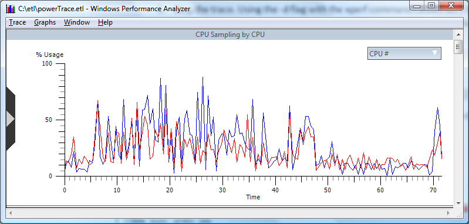

# Reviewing Trace Event Information

The following trace demonstrates CPU activity, as shown in the following screen shot:

To examine the P-state and C-state information contained in the trace, scroll through the various graph views. The P-state information is in the graph titled **CPU Frequency**, and the C-state information is in the graph titled **CPU Idle States**. By default, both graphs are shown, but if they do not appear, click the control on the left side of the xperf window to select them.

 

 

