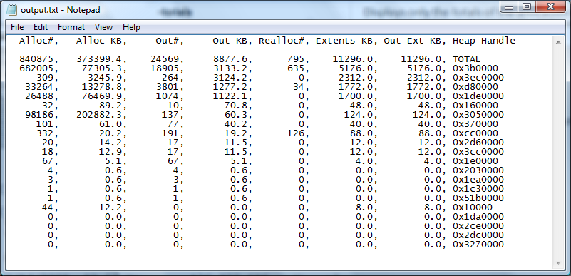

# Sample Heap Actions

The action command:


```
xperf -I heapSession.etl -o output.txt -a heap  
```


Writes a text file containing the output of a sample heap action, as shown in the following screen shot.



The action command:


```
xperf -I heapSession.etl -o frames.txt -symbols -a heap -stacks -cullLists cullfuncs.txt -top 25
```


This action may take several minutes to complete due to the heavy sorting and matching performed on large trace file. Frames listed in the cullfuncs.txt file will be deleted from the results, as shown in the following screen shot:


 

 


