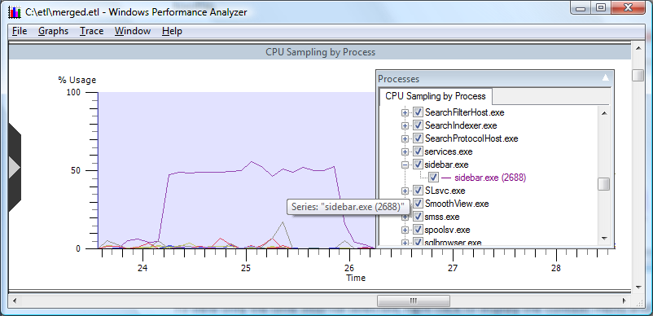

# Selecting Time Intervals

To select a specific time interval, left click and drag across the horizontal time scale. When you are satisfied with the time interval selection, release the left mouse button. To show only the selected time interval, right click on the graph, and select **Zoom To Selection** from the context menu. All graphs will be updated to show only the time interval selected.

The following screen shot shows CPU Sampling by Process expanded to a specific time interval.

In this **CPU Sampling by Process with Time Interval selected** graph, the time interval from approximately 23 seconds to 27 seconds has been selected. This interval displays significant processor usage. Note that the exact start and stop times of the selection are shown as a tooltip.

To view only the time interval selected, right click to display the context menu and select **Zoom To Selection**. To dynamically zoom and unzoom, press and hold the control key while rotating the mouse wheel.

As a result of "zooming" to the time interval selected in the previous graph, CPU Sampling by Process Expanded to a specific time interval, displays the area where considerable CPU time is consumed.

In order to return the graph to its original scale, right click to open the context menu and choose **Unzoom**.

The following screen shot shows CPU Sampling by Process expanded to a specific time interval.

 

 

