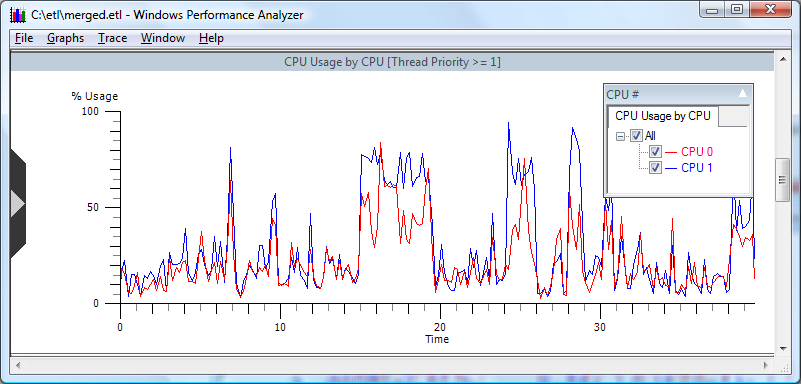
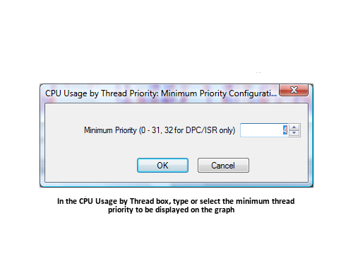

# Set Minimum Priority Level

In certain graphs, the "Set Minimum Priority" is available on the Context Menu drop down as displayed in **Choosing Set Minimum Priority Option**. This option enables the user to filter content by thread priority.

 

 

