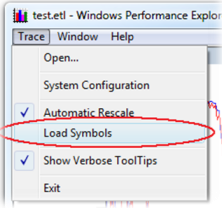
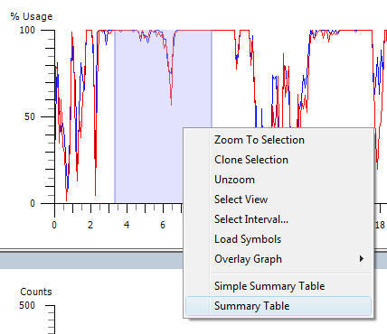
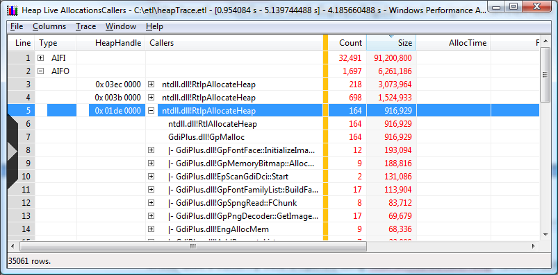
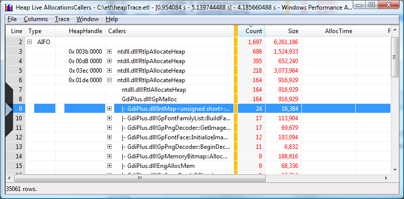

# Stack Walking

Enabling stack walking for kernel events will provide you with a powerful feature. When stacks are combined with symbol decoding, you can then display the call stack summary information for the events that had stack walking enabled.

Notice that stack walking support requires that symbol decoding be correctly configured. For more information on configuring symbol decoding, see [Symbol Support](symbol-support.md).

> [!Note]  
> The binaries to be used for the data collection must be compiled with Frame Pointer Omission optimization (FPO) disabled. Disabling FPO allows Windows Performance Analyzer to collect complete sets of call stack data. Windows binaries from Vista onward are compiled with FPO disabled. The Windows Client Performance Team recommends that all binaries, including release images, be compiled with FPO disabled. By compiling with FPO disabled developers will have complete access to call stacks and events generated by a process.

 

### Enabling Stack Walking for Kernel Events

One of the most powerful features of the ETW and the Windows Performance Analyzer is the ability to enable *stack walking* for the kernel events. When you enable stack walking for a kernel event, the kernel captures the call stack when the event is generated and saves it with the event. Stack walking is also called *stack tracing*. When stacks are combined with symbol decoding, Performance Analyzer displays call stack summary information for the events that had stack walking enabled. By using the following command, you can trace a find string utility that had stack walking enabled on the sample profile event:


```
xperf -on latency -stackwalk Profile 
```


After you have a trace with stack information, often called a stack trace, you can view the stack information in Performance Analyzer by using the following steps:

1.  Make sure [Symbol Support](symbol-support.md) is correctly configured.

2.  Load the stack trace into Performance Analyzer by using the following command.

    ```
    Xperf stacktace.etl
    ```

    

3.  On the **Trace** menu, click **Load Symbols**. Performance Analyzer loads the symbols for the binaries that are referenced in the trace. Be aware that this can take tens of seconds.

    The following screen shot shows the Load Symbols command on the Trace menu.

    

4.  Right-click an area of the CPU Sampling chart, and click **Summary Table**.

    > [!Note]  
    > Stack walking can only be enabled for kernel events. The ETW infrastructure in Windows does not support stack walking on events that are generated by other event providers.

     

    The following screen shot shows the Summary table command on a shortcut menu.

    

5.  Click the **Selector** tab to open the **Column Chooser**.

6.  Select the **Process name**, **Process**, **Stack**, **Weight** and **%Weight** check boxes. These columns are most helpful when you need to view stacks from the sample profile event.

    > [!Note]  
    > You only need to do this one time, Performance Analyzer will remember your column settings.

     

    Your summary table should look similar to the following screen shot:

    

This example shows that most of the time was spent in the main thread reading lines from the file.

You can enable stack walking by using the **-stackwalk** Xperf command. ETW supports stack walking for up to 16 events at a time. If you need help with how to enable stack walking or if you need a list of the kernel for which stack walking can be enabled, use the following command:


```
xperf -help stackwalk 
```


### The Tree View

First, drill into outstanding allocations in the tree view sorted by size because those allocations are responsible for persistent heap usage. The summary table shows that the IE process has a large number of heaps that contribute to outstanding size, with the first three being the most significant. A call stack for investigation can be selected by clicking on the corresponding row and then using the right arrow on the keyboard to expand the visible portion of the stack. Holding down the arrow key does recursive expansion down the path determined by the sorting order specified by the column selection. Conversely, holding down the left arrow collapses the visible portion of the stack. The mouse can also be used to expand and contract individual rows by clinking on the \[+\] or \[-\].

The call stack below shows that the atiumdag.dll is responsible for the bulk of the allocation size in the first call stack. The question mark where the function name would typcially appear indicates that sysmbols for this module are not available. This it is not unexpected since atiumdag.dll is the ATI video driver for which there are no publicly available symbols.

The example below is sorted by the Size column.


Closing the first heap handle and opening the second heap handle presents the data displayed in the summary table below. This view contains several issues that must be explained.

We would expect all of the data in any of the stack views to start with the thread start function ntdll.dll!\_RtlUserThreadStart at the base and expand outward, branching being dependent on calling patterns. There are two cases however, where this may not be the case:

-   Maximum stack depth is exceeded. Call stacks that exceed the maximum depth of WPA data collection capability is a common issue. This occurs when the maximum number of stack frames that WPA can collect is exceeded causing fragmented or split stacks. Fragmented stacks make the data analysis more challenging because the complete call stack cannot be determined directly from the data. In many cases knowledge of the code base for the scenario being analyzed and its calling patterns can help resolve the ambiguity caused by split stacks.

-   The image is compiled using Frame Pointer Omission (FPO) optimization. Since the Vista release, Windows has been compiled with FPO disabled. This issue should not be manifested in binaries produced by Microsoft. However, third party drivers, applications, and plug-ins often are compiled with FPO enabled leading to fragmented or split stacks.

### The Butterfly View

The butterfly view of a summary table flips the call stack so that function will be used as a base function. This feature provides the following:

-   A hierarchical view of function execution allowing the user to view a function in a recursive manner.

-   Using the butterfly view on ntdll.dll!RtlAllocateHeap helps to aggregate split stacks in a more meaningful manner since the aggregation is done starting at the leaf node and not at the missing call stack root. However, it should be noted not all heap allocations will be made during calls to ntdll.dll!RtlAllocateHeap. Care should be taken to account for those allocations made from calls to different allocating functions in ntdll.dll.

-   Note the size and lifetime data for the allocations will be more separated from the allocating function in the summary table which makes some data interpretation more difficult.

To create a butterfly view of the calls to a function, select its row, right click and then select "**callers/Innermost...**" from the context menu. If the selected function is ntdll.dll!RtlAllocateHeap, it will flip the call stacks such that this function will be used as the base function for the stack displays as shown below. The same techniques described above to navigate the stacks can be used.

The following screen shot shows how a butterfly view is opened using ntdll.dll!RtlAllocateHeap function as the outermost caller in the 0x01de 000 heap. 164 allocations using 916,929 bytes have been made by GdiPlus.dll. Applications based on the Microsoft Win32 API do not access graphics hardware directly. Instead, GDI+ interacts with device drivers on behalf of applications.



By changing the sorting order to count, as illustrated in the following screen shot, the outermost caller and the expanded the call stacks are displayed. Note the sort is now by the count of allocations. This view presents functions that have the most allocations based on count.



 

 


