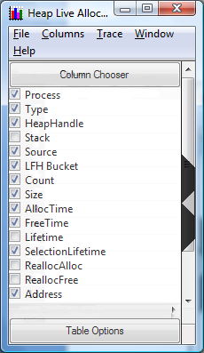

# Summary Table Column Selection

The first time the summary table is displayed it may not have all of the useful columns displayed. The flyout configuration panel can be used to add or remove columns from the summary table. It is displayed by clicking on the chevron on the left edge of the table display. The screen shot below illustrates the recommended default selections for columns. However, depending on the scenario, other selections can make issues more apparent during analysis and examples will be discussed later.

 

 

