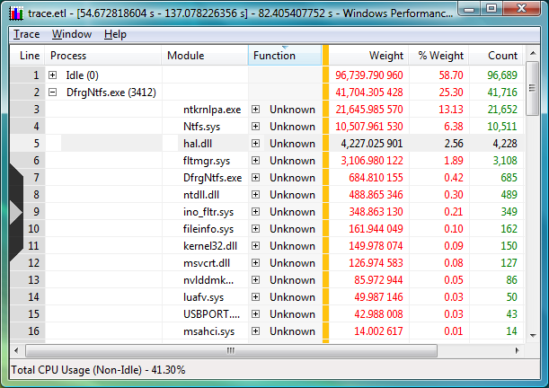

# Summary Tables

### Opening Summary Tables

You can open a summary table by right-clicking a graph, and then clicking **Summary Table**. The following screen shot shows an example of a summary table:

### Interpreting Summary Tables

The summary table presents data over the selection interval. You can sort columns in both ascending and descending order. By using summary tables, you can group rows of data by the values in the columns to the left of the gold bar and aggregate the following columns accordingly. The order of the grouping columns determines the grouping hierarchy. You can expand and collapse the groups by clicking the plus or minus sign at the left or by using the arrow keys on the keyboard. You can drag the columns around, dynamically changing groups according to your needs. Any displayed column can become a grouping column if it is moved to the left of the gold bar, or a value column, if it is moved to the right of the gold bar. If you click a column header of the table, you sort the data in the table by the corresponding column at both group level and at subgroup and individual level inside groups. By clicking again on the same column, you reverse the sort order for that column. Columns can be shown or hidden from the selector on the left sidebar. In the previous example, the table groups the rows hierarchically by the values in the Process, Module, and Function columns. The Weight, Weight %, and Count columns are aggregated, the first two as Sum (red) and the third as count (green). Other aggregation modes include Max (dark gray), Min (light gray), and Average (blue). The other columns are not aggregated; their values are shown in black.

For example, in the previous example, the module Ntkrnlpa.exe that runs inside process DfrgNtfs.exe took 7.5% of the CPU over the selection interval. However, if the Process and Module column are swapped, one can observe in what processes the module Ntkrnlpa.exe ran and what the total weight of the module is across all the processes (system-wide) over the selection interval. The summary table provides a context menu with options for how to copy the current cell, the selected rows, or the full table to the clipboard and to export the selected rows, the displayed rows or the whole table to a text file that has comma-separated values. These copied or exported sub-tables can be pasted or opened for viewing by using a spreadsheet or text editor. For stack columns, the context menu provides access to caller and callee views that are joined at the stack frame under the mouse cursor. When one of these options is selected on a primary summary table, a secondary summary table is opened with the new data and aggregation. By selecting one of these options on a secondary table, you change the view inside the same summary table.

 

 

