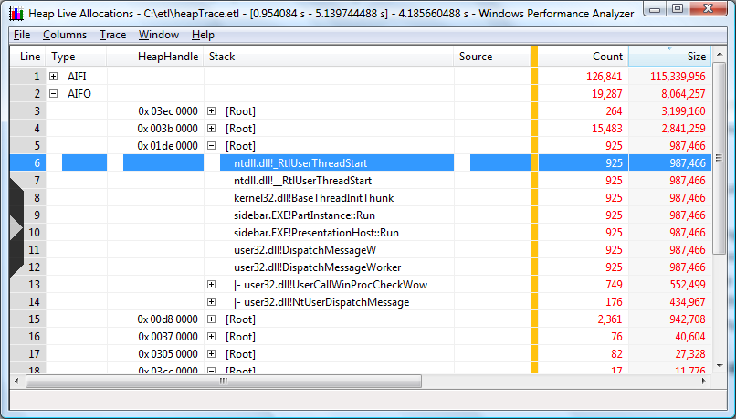

# Thread Start Functions

Closing the first heap handle and opening the third heap handle displays a Tree view sorted by allocation size with the second heap handle open, as shown in the following screen shot.

Normally, the expectation is stack views start with the thread start function ntdll.dll!\_RtlUserThreadStart at the base and expand outward. However, there are two cases where ntdll.dll!\_RtlUserThreadStart may not be the originating function:

-   Maximum call stack depth is exceeded. Call stacks that exceed the depth of WPA data collection capability can be an issue. This occurs when the maximum number of stack frames that WPA can collect is exceeded causing fragmented or split stacks. Fragmented stacks make the data analysis more challenging because the complete call stack cannot be determined directly from the data.

    In most cases knowledge of the code base, understanding the scenario being analyzed and calling patterns can help resolve the ambiguity caused by split stacks.

-   The image is compiled using Frame Pointer Omission (FPO) optimization. Since the Vista release, Windows has been compiled with FPO disabled. This issue should not be manifested in binaries produced by Microsoft. However, third party drivers, applications, and plug-ins often are compiled with FPO enabled leading to fragmented or split stacks.

 

 

