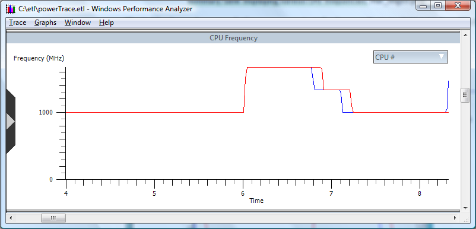

# To Check P-state at a Specific Time

To see additional information about the P-state at a specific time, zoom in on a particular area of the graph. For example, the following screen shot shows details about times at which the CPU exited from the lowest P-state.

In this example, the system elevated its P-state only briefly and is therefore not a concern. However, if the CPU enters a higher P-state for a long time, you might choose to perform further analysis.

 

 

