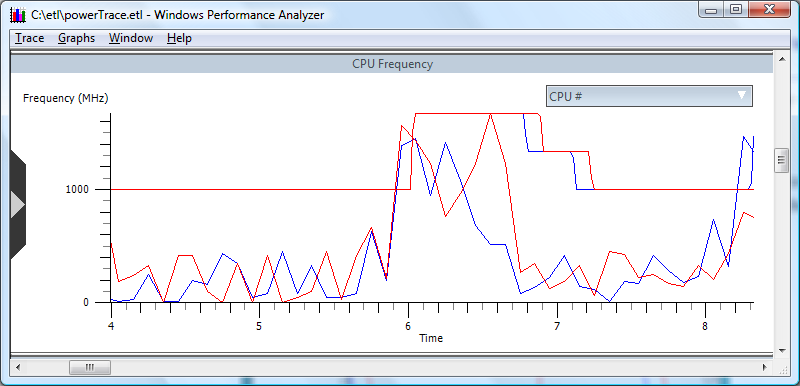

# To Examine Specific Activity on a Processor that Might have Caused the CPU to Enter the Higher P-state

With the CPU Frequency graph open, right-click any area of the graph to open the context menu. Select **Overlay Graph**. Select the **CPU Sampling by CPU** graph, and then select **All**.

The resulting graph displays both the CPU frequencies and a percentage sampling of CPU activity, as shown in the following screen shot. Analysis of this overlaid graph can be useful to identify CPU processor power issues.

 

 

