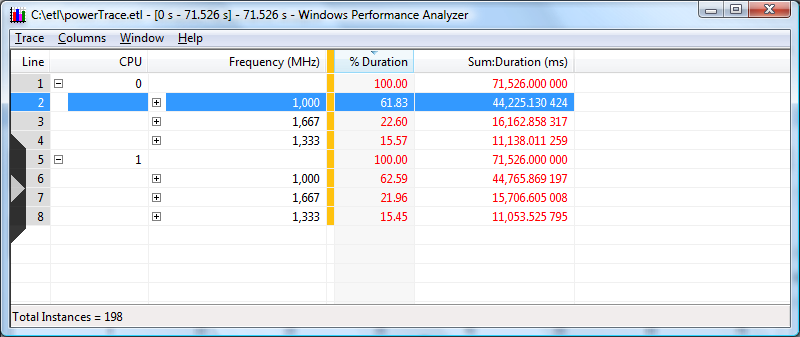

# To See How Much Time the CPU Spent at Each P-state

To see how much time the CPU spent at each P-state:

1.  Right-click in the **CPU Frequency (MHz)** graph area to select the entire view of the P-state graph, and then select **Select View** from the drop-down menu, as shown in the following screen shot:

    

    Note: An initial analysis of lower P-states may indicate, correctly, that certain power benefits are being achieved. However, this assumption may mislead if all state information is not considered.

2.  To display the data in tabular form, right-click to select the entire view of the P-State graph in the **CPU Frequency (MHz)** graph area and select **Select View** from the drop-down menu. After the entire graph is selected, right-click again and select **Summary Table**. This displays the date shown in the following screen shot:

    

    The table shows how much time was spent at the lowest P-state (800 MHz) and in the higher states (1,600 and 2,600 MHz on this system).

 

 

