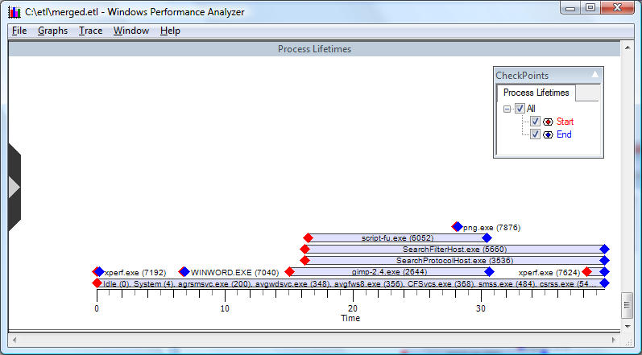

# Types of Graphs

There are four types of graphs produced by WPA:

-   **Usage graphs** - These graphs show the usage patterns for individual system resources, as shown in the following screen shot.

    

    For information regarding the algorithms used in calculating usage data, please see [Calculating Usage](calculating-usage-graphs.md) in the Appendix of this document.

-   **Histogram graphs** - A histogram or "bucket" graph plots the distribution frequency of events over time. Each discrete vertical section of a graph bar is referred to as a bucket. Each bucket is assigned a color. Colors can be changed by the user. For more information on customizing legend colors please see [Identifying and Selecting Data Series with the Legend](identifying-and-selecting-data-series-with-the-legend.md).

    Bars and buckets are dynamic based on the time interval, or X-axis, covered by a bar. Time intervals are controlled by the **Zoom to Selection** option selected from the context menu of the graph.

    The following screen shot shows an example of a Histogram Graph, Disk I/O.

    

-   **Lifetime graphs** - These graphs plot a time interval on the X-axis. Individual categories, such as processes, are plotted on the Y-axis, as lanes, that define the lifetime of the category, as shown in the following screen shot.

    

-   **Event graphs** - Each selected event provider is identified by color on the y axis. Events generated by the provider are displayed as tics on the graph, as in the following screen shot.

    

WPA presents graphs that use intelligent default options for size, color, and graph order. You can customize each of these aspects based on analyst requirements.

 

 

